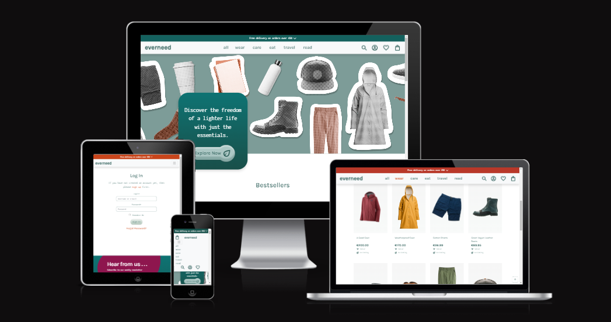
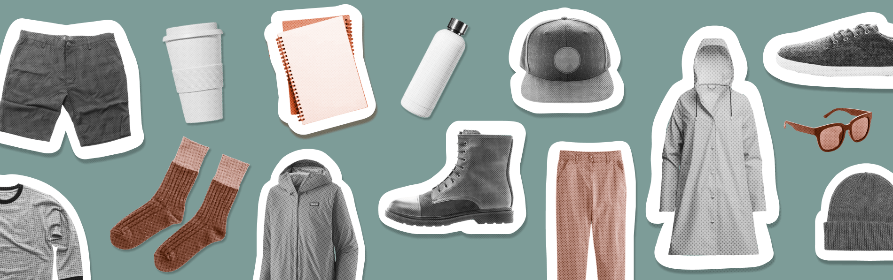
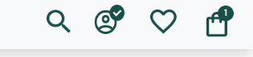
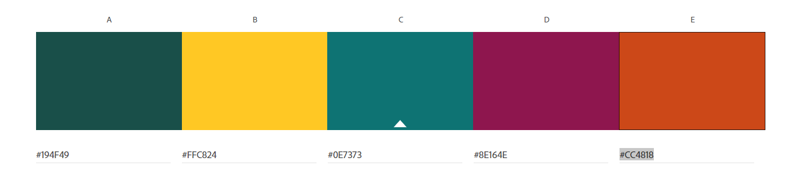
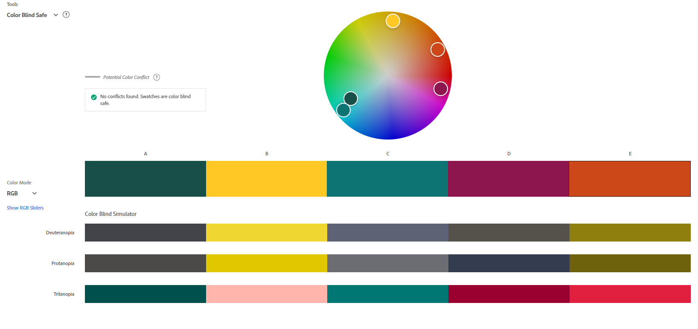
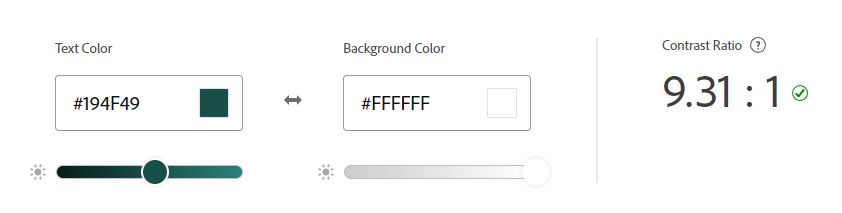
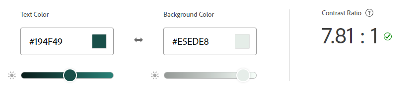
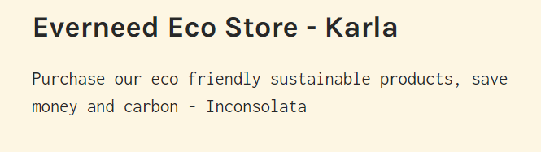

# everneed



## Introduction

Everneed is an e-commerce site selling practical, sustainable, earth-friendly products with a carbon-footprint total for your order. It has been developed as my Portfolio Project 5 for the Code Institute's Full Stack Software Developer Course using Django, HTML, CSS, JS & Python.

Everneed has been created using carbon data from available product carbon footprints, or [PCFs](https://tinyurl.com/2htnyr9w). As this data is relatively new, this website is to be viewed with the understanding that the data within is unvalidated, 'fictional' data, calculated to the best of my abilities from all available information on the internet. It's purpose is to purely aid in developing the website's concept.

With the growing threat of climate change and sudden mass displacement of large communities from natural disasters, there has never been a more important time, in recent years, to have a 'Go-Bag' ready for yourself and family members. The initial concept of this website was to introduce the idea of living with a minimum of necessary items, in an attempt to escape capitalism and free ourselves to be able to experience life and spend time with our loved ones. This concept could be a more grim, mandatory idea in the not-too-distant future, if all manufacturing of unnecessary goods were to cease in an sudden effort to meet a new global carbon emmissions target, since we have already shot through the [existing ones](https://www.unep.org/resources/emissions-gap-report-2022#:~:text=The%20world%20is%20not%20on,cent%20to%20avoid%20global%20catastrophe.).

Choosing to only purchase 100% necessary items, that have been created in the most sustainable way, and to be aware of your carbon spending at the same time, could be an e-commerce store type that will be with us sooner than we think. [Carbon credits](https://carboncredits.com/carbon-credits-explained-2023-guide/) are already being implemented in industrial and agricultural sectors in an effort to slow our global carbon emissions rate, it could, in the near future, start affecting our purchases as individuals.

View live site: [everneed](https://everneed-096aafe5d13c.herokuapp.com/)

For full Admin access to Django Admin panel with relevant sign-in credentials: [Everneed Admin](https://everneed-096aafe5d13c.herokuapp.com/admin/)

For access to Admin Dashboard frontend view with relebant sign-in credentials: [Everneed Admin Dashboard](https://everneed-096aafe5d13c.herokuapp.com/products/admin_dashboard/)


## Table of Contents

- [everneed](#everneed)
  - [Introduction](#introduction)
  - [Table of Contents](#table-of-contents)
  - [Overview](#overview)
  - [Customer Goals](#customer-goals)
  - [Business Goals](#business-goals)
- [UX/UI - User Experience/User Interface](#uxui---user-experienceuser-interface)
  - [Design Inspiration](#design-inspiration)
    - [Color Scheme](#color-scheme)
    - [Typography \& Iconography](#typography--iconography)
- [Project Planning](#project-planning)
  - [Strategy Plane](#strategy-plane)
    - [Site Goals](#site-goals)
  - [Agile Methodologies](#agile-methodologies)
    - [MoSCoW Prioritization](#moscow-prioritization)
    - [Sprints](#sprints)
    - [Marketing](#marketing)
  - [User Stories](#user-stories)
    - [Visitor User Stories](#visitor-user-stories)
    - [Admin User Stories](#admin-user-stories)
  - [Scope Plane](#scope-plane)
  - [Structural Plane](#structural-plane)
  - [Skeleton Plane](#skeleton-plane)
    - [Wireframes](#wireframes)
    - [Database Schema](#database-schema)
  - [Surface Plane](#surface-plane)
    - [Defensive Design](#defensive-design)
- [Features](#features)
  - [User View](#user-view)
  - [CRUD Functionality](#crud-functionality)
  - [Features Showcase](#features-showcase)
    - [Admin View](#admin-view)
    - [Error Pages](#error-pages)
  - [Future Features](#future-features)
- [Technologies \& Languages Used](#technologies--languages-used)
  - [Libraries \& Frameworks](#libraries--frameworks)
  - [Tools \& Programs](#tools--programs)
- [Testing](#testing)
- [Deployment](#deployment)
  - [Connecting to GitHub](#connecting-to-github)
  - [Django Project SetUp](#django-project-setup)
  - [Relevant API's - details](#relevant-apis---details)
  - [Heroku Deployment](#heroku-deployment)
  - [AWS Config](#aws-config)
  - [Stripe Config](#stripe-config)
  - [Clone Project](#clone-project)
  - [Fork Project](#fork-project)
- [Credits](#credits)
  - [Code](#code)
  - [Media](#media)
    - [Additional reading/tutorials/books/blogs](#additional-readingtutorialsbooksblogs)
  - [Acknowledgements](#acknowledgements)

## Overview
Everneed is an eco-friendly products store focusing on procuring the best in sustainabale, long-life products. Users are invited to:

- View the store as Guests
- Register for an Account
- Use the stores Wishlist feature to record liked products
- Browse products by category and price
- View, add and edit products in their bag
- Discover their carbon savings on certain items
- As registered users, view past orders
- Read the latest articles on climate change and environmental impacts
- Sign up for a weekly environment issues newsletters

Everneed is accessible via all browsers with full responsiveness on different screen sizes. It's aim is to raise awareness of our carbon spend and provide an alternative to the fast-fashion trap. 

## Customer Goals

Customers are provided with an easy, intuitive shopping experience and are encouraged to avail of sustainable, eco-friendly products. It is hoped that customers will sign up/register an account with everneed to be able to avail of the full range of user features. Customers are consistenly encouraged to make the best choices in terms of quality, environmentally friendly products. A sense of community is created with a weekly newsletter which will inform the customers of new products, trends and articles on everneed.


## Business Goals

Everneed provides easy Admin functionality for the business owner with an accessible, easy-use Admin Dashboard to manage inventory and articles. The additonal frontend forms allows the business owner to make quick and easy changes. Further information regarding users and orders can be accessed via the Admin Dashboard with a direct link to the information stored within the Django Admin Panel. 

Everneed seeks to build a strong base of regular shoppers who seek long-life, quality products made from high quality, natural materials. The newsletter, articles and carbon footprint features aim to attract those who have concerns for the rising environmental issues that our planet faces. Further marketing is made through the businesses social media channels, in particular their Facebook page.


# UX/UI - User Experience/User Interface

## Design Inspiration

From the beginning of the project, I knew that the colour palette would reflect nature with shades of green acting as the primary colour, in particular forest green, #194f49. The website is kept clean, with good flow, using plenty of white space to draw attention to the products and the website's mission in reducing the carbon footprints of it's users.

A simple logo, created using [LogoAI](www.logoai.com) is used as a favicon and email branding logo. The logo depicts a plant trapped within a vault, as we must protect our environment at all costs.

  
*Everneed logo*

Only the necessary information is displayed so as to not increase the size of the website and it's own carbon footprint. Purple #8E164E and gold #CC4818 are used as accents to draw attention to active buttons and carbon totals. I created a hero image, using Figma and the site's product images, to add a modern, graphic edge to the website.


*Image created by myself in Figma using product images*

Product images are kept clean with no backgrounds so that focus is on the product itself. Feedback is continuously provided to the user via the website's header which displays whether the user is logged in and how many items are in their bag. Message 'toasts' are also visible upon user actions to display further information.

  
*Header feedback is kept clean and intuitive*

### Color Scheme


*Everneed Color Scheme*

Variables were used within the CSS file to call colours as they were needed:
- --forest: #194f49;
- --yellow: #ffc824;
- --bluegreen: #0e7373;
- --purple: #8E164E;
- --gold: #CC4818;
- --white: #fff;
- --black: #0d0d0d;

The above colours were chosen to reflect colours found naturally within nature. The primary, dominant colour of forest green #194f49, is used repretedly throught the website for it's font and main sectioning. A muted version is used for dashed borders for input field focus and feedback to the user, this replaces the default blue border used in most browsers. The main buttons are created using #e5ede8 in a gradient to a darker #b5c9bd. This creates a sense of depth and creates a 3D feel to the buttons.

  
*Everneed Main Button*

The purple is used when a button or field text is brought into focus by the user, this provides feedback that there is an action available in the feature/area. The gold is used to provide contrast for important text that provides a link and also in the 'Subscribe' button visible in the newsletter section of the footer area.White space is maintained throughout the website to keep it clean, clear and fresh.

Further preparation for the colour scheme was carried out on [Adobe Color](https://color.adobe.com/create/color-accessibility) to check for contrast levels and accessibility for those with sight issues. Text contrasts were checked also to ensure they exceeded the WCAG 2.1 Level for suitable contrast of web text.


  
*Everneed Color Accessibility Check*

  
*Everneed Color Contrast Check - Main*

  
*Everneed Color Contrast Check - Button*


### Typography & Iconography


*Everneed Font Pairing*

Karla and Inconsolata were both imported foom [Google Fonts](https://fonts.google.com/). They were chosen for their compatibility and aesthetics that aligned with the store brand. Karla is a sans-serif typeface with a clean and modern design which delivers a fresh and simple look to the store. Inconsolata is a monospace font which allows clear display of descriptions and information about the products. Together they apply enough textual contrast to allow for a good flow of information to the user, improving user experience. Using Google Fonts allows for faster, reliable loading times for the website, ensuring the user stays when they visit.

In development, 'Karla' was identified by variable ```--title```, whilst 'Inconsolata' was set as ```--main-font``` within the CSS file. Similar to my setup for the project's colours, using variables helped to speed up the frontend process.

# Project Planning

## Strategy Plane

### Site Goals

## Agile Methodologies

### MoSCoW Prioritization

### Sprints

| Sprint No. | Sprint Content | Start/Finish Dates |
|------------|----------------|--------------------|
|    # 1     | Project Setup  |                    |
|    # 2     | AllAuth & Basic Naviagtion |        |
|    # 3     | Product Views & CRUD       |        |
|    # 4     | Shopping Bag Functionality & Styling |      |
|    # 5     | Wishlist Feature   |                |
|    # 6     | Carbon Footprint & Articles  |      |
|    # 7     | Admin Dashboard        |            |
|    # 8     | User/Customer Correspondence  |     |
|    # 9     | Documentation & Testing   |         |

### Marketing

## User Stories

### Visitor User Stories

### Admin User Stories

## Scope Plane

## Structural Plane

## Skeleton Plane

### Wireframes

### Database Schema

## Surface Plane

### Defensive Design

# Features

## User View

## CRUD Functionality

## Features Showcase

### Admin View

### Error Pages

## Future Features

# Technologies & Languages Used

- HTML
- CSS
- JavaScript
- Python
- [Git](https://git-scm.com/) used for version control.
- [Github](https://www.github.com) used for online storage of codebase and Projects tool.
- [CodeAnywhere](https://app.codeanywhere.com) as an online, cloud-based IDE for development.
- [Figma](https://www.figma.com) for project design planning and wireframe creation.
- [Adobe Color](https://color.adobe.com) for colour theme creation and accessibility checkers.
- [Django](https://www.djangoproject.com/) was used as the Python framework for the site.
- [Heroku](https://www.heroku.com) was used to host the 'everneed' application.
- [WAVE](https://wave.webaim.org/) to evaluate the accessibility of the site.
- [Procreate](https://procreate.com/) for image creation and editing.

## Libraries & Frameworks

Libraries and frameworks used were dictated by the 'Boutique Ado' walkthrough from our course material with the Code Institute. This project will be upgraded on completion of the course to more recent packages to meet current standards and security packages.

- [Bootstrap v4.6](https://getbootstrap.com/docs/4.6/getting-started/introduction/)
- [Django v3.2](https://docs.djangoproject.com/en/4.2/releases/3.2/)
- [AllAuth v0.41](https://django-allauth.readthedocs.io/)

## Tools & Programs
- [ImageCompressor](https://imagecompressor.com/) for compressing PNG/WEbp files
- [Image ReSizer](https://www.simpleimageresizer.com/) for reducing image size
- [EZGif](<https://ezgif.com/>) for gif conversion.
- [Convertio](https://convertio.co/) for file conversion to PNG, WEBP.
- [Tiny Png](https://tinypng.com/) for file size reduction.
- [Lucidchart](https://www.lucidchart.com/pages) for ERD (entity relationship diagram) creation.
- [Favicon](https://favicon.io/) for converting an icon into favicon.
- [amiresponsive](https://ui.dev/amiresponsive) for screenshot of Everneed on different screen sizes.
- [Perplexity AI](https://www.perplexity.ai/) for breaking down Python concepts and Django documentation into more understandable chunks.


# Testing

- For all testing, please refer to the [TESTING.md](TESTING.md) file.

# Deployment

## Connecting to GitHub  

To begin this project from scratch, you must first create a new GitHub repository using the [Code Institute's Template](https://github.com/Code-Institute-Org/ci-full-template). This template provides the relevant tools to get you started. To use this template:

1. Log in to [GitHub](https://github.com/) or create a new account.
2. Navigate to the above CI Full Template.
3. Click '**Use this template**' -> '**Create a new repository**'.
4. Choose a new repository name and click '**Create repository from template**'.
5. In your new repository space, click the purple CodeAnywhere (if this is your IDE of choice) button to generate a new workspace.

## Django Project SetUp

## Relevant API's - details

## Heroku Deployment

## AWS Config

## Stripe Config

## Clone Project

## Fork Project

A copy of the original repository can be made through GitHub. Please follow the below steps to fork this repository:  

1. Navigate to GitHub and log in.  
2. Once logged in, navigate to this repository using this link [everneed Repository](https://github.com/amylour/everneed).
3. Above the repository file section and to the top, right of the page is the '**Fork**' button, click on this to make a fork of this repository.
4. You should now have access to a forked copy of this repository in your Github account.
5. Follow the above Django Project Steps if you wish to work on the project.

# Credits

## Code

The following blogs/tutorials complemented my learning for this project, alongside the [Code Institute's](https://codeinstitute.net/ie/) Learning Content.

- [Django Docs](https://www.djangoproject.com/)
- [Bootstrap Docs](https://getbootstrap.com/docs/4.6/getting-started/introduction/)
- [Code Institute's](https://github.com/Code-Institute-Org>) Blog/Boutique Ado walkthroughs
- [Daisy McGirr's](https://www.youtube.com/@IonaFrisbee) easy to follow Django Recipe App tutorial for understanding how to use Django's MVT framework
- Remove blue highlight shadow from around input field when selected [StackOverflow](https://tinyurl.com/yk2uaf8c)
- Newsletter sign up template and SVG [Bootsnipp](https://bootsnipp.com/snippets/6XVAB)
- Change color of Bootstrap svg item using background image url [Codepen](https://codepen.io/noahblon/post/coloring-svgs-in-css-background-images)
- Bootstrap e-commerce carousel for 'Bestsellers/Featured Items' [GeekProbin](https://www.youtube.com/watch?v=8g9Glz5VlZo) & [colorlib](https://colorlib.com/wp/template/carousel-02/)
- Scroll fade in animation for 'Mission' section [Nucleio Tech](http://tinyurl.com/5c6d5nhy)
- Underline animation for 'Our Mission' section [Youtube](https://www.youtube.com/watch?v=wsDZm6PXeVw)
- Scroll to top button & hide/show button [devdevshow](https://devdevshow.com/back-to-top-button-scroll-button-css/)
- Change color of checkbox using 'accent' [CodeProject](https://tinyurl.com/jtecnb39)

## Media

- [Freepik](https://www.freepik.com) for images used within the site
- [Pexels](https://www.pexels.com/) for images used within the site
- [Unsplash](https://unsplash.com/) for images used within the site
- [Flaticon](https://www.flaticon.com) for icons used in wireframing and on the website

<details>
<summary>Image credits are as follows:</summary>

- jumpsuit: https://www.freepik.com/free-photo/blonde-woman-beige-jumpsuit-with-design-space-streetwear-apparel-full-body-set_15476228.htm#query=cottonjumpsuit&position=1&from_view=search&track=ais?log-in=google
- shorts: https://www.freepik.com/free-photo/casual-men-short-pants_1135444.htm#query=trousers&position=4&from_view=autho
- green boots: https://www.freepik.com/free-photo/leather-boots_1135347.htm#query=boots&position=0&from_view=author
- brown boots: https://www.freepik.com/free-photo/leather-boots_1135371.htm#query=boots&position=4&from_view=author
- brown sandal: https://www.freepik.com/free-photo/beautiful-men-sandal_1123563.htm#query=sandals&position=13&from_view=author
- longsleeve: https://www.freepik.com/free-photo/t-shirt_1135214.htm#query=tshirt&position=12&from_view=author
- sunglasses: https://www.freepik.com/free-photo/sunglasses_1135982.htm#query=sunglasses&position=1&from_view=author
- baseball hat: https://www.freepik.com/free-photo/background-textile-protection-back-object_1095637.htm#query=hat&position=13&from_view=author
- tshirt: https://www.freepik.com/free-photo/white-shirt_9187460.htm#query=cotton%20t%20shirt&position=32&from_view=search&track=ais
- hoody: https://www.freepik.com/free-photo/black-hoodie-with-zipper_13237308.htm#query=zip%20up%20hoody&position=0&from_view=search&track=ais
- first aid kit: https://www.freepik.com/free-photo/flat-lay-health-still-life-arrangement-with-copy-space_12412903.htm#query=first%20aid%20kit&position=7&from_view=search&track=ais
- notepad: https://www.freepik.com/free-photo/top-view-notebooks-table_12062758.htm#query=notepad&position=0&from_view=search&track=sph
- backpack: https://www.freepik.com/free-photo/female-with-backpack-field_8741104.htm#query=backpack&position=20&from_view=search&track=sph
- daybag: https://www.freepik.com/free-photo/shallow-focus-shot-male-wearing-grey-brown-rucksack_11486735.htm#query=leather%20satchel&position=17&from_view=search&track=ais
- satchel: https://www.freepik.com/free-photo/shallow-focus-view-male-wearing-brown-leather-satchel_10606014.htm#query=leather%20messenger%20bag&position=3&from_view=search&track=ais
- water bottle: https://www.freepik.com/free-photo/white-reusable-water-bottle_19002897.htm#query=reusable%20water%20bottle&position=10&from_view=search&track=ais
- coffee cup: https://www.freepik.com/free-photo/front-view-hand-held-cup_6404799.htm#query=reusable%20coffee%20cup&position=24&from_view=search&track=ais
- torch: https://www.decathlon.ie/torches/325763-140976-autonomous-torch-dynamo-100-v2-blue-15-lumens.html?gclid=Cj0KCQjwldKmBhCCARIsAP-0rfxy-twuGUE6ph3afT1dGJcdTnB-HZXXBTo-tGXvgtaAhlcXUFCCSr0aAuSWEALw_wcB#/demodelsize-254no_size/demodelcolor-8665145
- trousers: https://www.next.ie/en/style/st221795/u96659?dndl=1&gclid=Cj0KCQjwldKmBhCCARIsAP-0rfwj2BwEtaQjy6fPt0NokflR6Q0P6dUig_lOMONAPF_6yV2qxSoL6QwaAp6QEALw_wcB&gclsrc=aw.ds#U96659?istCompanyId=d873714f-34f4-48ef-9a74-219bd03bc0c5&istFeedId=4b29b1a2-79a4-46e3-b924-1ad34869c8d7&istItemId=rrlilxmrt&istBid=t
- raincoat: https://stutterheim.com/women/jackets/raincoats/mosebacke-lightweight-warm-honey?currency=EUR&gclid=Cj0KCQjwldKmBhCCARIsAP-0rfxdhAtGfqfukXq8_nwyLE1dAcdw8L1VAsdqYIcLgEA0pa9iftFpZzAaAhNKEALw_wcB
- beanie: https://stutterheim.com/women/jackets/raincoats/mosebacke-lightweight-warm-honey?currency=EUR&gclid=Cj0KCQjwldKmBhCCARIsAP-0rfxdhAtGfqfukXq8_nwyLE1dAcdw8L1VAsdqYIcLgEA0pa9iftFpZzAaAhNKEALw_wcB
- lifestraw https://eu.lifestraw.com/
- radio: https://www.wired.com/2009/06/solar-powered-hand-cranked-radio/
- bivvy: https://www.trailspace.com/gear/sol/thermal-bivvy/
- razor: https://www.bambaw.com
- matches: https://www.trailspace.com/gear/uco/stormproof-match-kit/
- stasher bags: https://www.stasherbag.com/
- kleen kanteen: https://www.kleankanteen.co.uk/products/insulated-tkpro-16oz-500ml
- soap: https://threehillssoap.ie/
- shaving brush: https://www.freepik.com/free-photo/close-up-shaving-brush-isolated-white-background_4183271.htm#query=shaving%20brush%20on%20white%20background&position=10&from_view=search&track=ais
- cutlery: https://jungleculture.eco/collections/bamboo-cutlery
- beeswax wraps: https://irelandbeeswaxwraps.ie/product/variety-4-pack/
- aeropress: https://www.aeropress.com
- cotton pads: https://www.memo.de/10er-pack-memo-bio-baumwoll-kosmetikpads-duo-inkl-waeschebeutel-g4496
- bamboo mirror: https://www.amazon.co.uk/Joy-Bamboo-friendly-Portable-Make-up/dp/B08D4P9W24
- sleeping bag: https://rab.equipment/eu/ascent-pro-800?queryID=3209eecd7bf0a65bda2700816a2b518b&objectID=32155&indexName=rab_live_eu_products
- daybag: https://eu.patagonia.com/ie/en/product/refugio-daypack-30-liters/47928.html?dwvar_47928_color=SFBL&cgid=luggage
- medium bag: https://eu.patagonia.com/ie/en/product/altvia-pack-28-liters/48910.html?dwvar_48910_color=LMBE&cgid=luggage
- big bag: https://www.sixmoondesigns.com/products/minimalist-v2-ultralight-backpack
- black tshirt: https://www.freepik.com/free-photo/isolated-opened-black-t-shirt_19425579.htm#query=tshirt%20plain&position=6&from_view=search&track=ais
- felt shoes: <https://www.freepik.com/free-photo/isolated-opened-black-t-shirt_19425579.htm#query=tshirt%20plain&position=6&from_view=search&track=ais>


### Additional reading/tutorials/books/blogs

- [Python Crash Course](https://www.oreilly.com/library/view/python-crash-course/9781492071266/), Author: Eric Matthes, Publisher: No Starch Press, Year: 2019 Edition.
- [Geeks for Geeks](https://www.geeksforgeeks.org/python-programming-language/?ref=ghm) for additional Python learning.

## Acknowledgements


