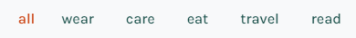

# everneed


## Introduction

Everneed is an e-commerce site selling practical, sustainable, earth-friendly products with a carbon-footprint total for your order. It has been developed as my Portfolio Project 5 for the Code Institute's Full Stack Software Developer Course using Django, HTML, CSS, JS & Python.

Everneed has been created using carbon data from available product carbon footprints, or [PCFs](https://tinyurl.com/2htnyr9w). As this data is relatively new, this website is to be viewed with the understanding that the data within is unvalidated, 'fictional' data, calculated to the best of my abilities from all available information on the internet. It's purpose is to purely aid in developing the website's concept.

With the growing threat of climate change and sudden mass displacement of large communities from natural disasters, there has never been a more important time, in recent years, to have a 'Go-Bag' ready for yourself and family members. The initial concept of this website was to introduce the idea of living with a minimum of necessary items, in an attempt to escape capitalism and free ourselves to be able to experience life and spend time with our loved ones. This concept could be a more grim, mandatory idea in the not-too-distant future, if all manufacturing of unnecessary goods were to cease in an sudden effort to meet a new global carbon emmissions target, since we have already shot through the [existing ones](https://www.unep.org/resources/emissions-gap-report-2022#:~:text=The%20world%20is%20not%20on,cent%20to%20avoid%20global%20catastrophe.).

Choosing to only purchase 100% necessary items, that have been created in the most sustainable way, and to be aware of your carbon spending at the same time, could be an e-commerce store type that will be with us sooner than we think. [Carbon credits](https://carboncredits.com/carbon-credits-explained-2023-guide/) are already being implemented in industrial and agricultural sectors in an effort to slow our global carbon emissions rate, it could, in the near future, start affecting our purchases as individuals.

View live site: [everneed](https://everneed-096aafe5d13c.herokuapp.com/)

For full Admin access to Django Admin panel with relevant sign-in credentials: [Everneed Admin](https://everneed-096aafe5d13c.herokuapp.com/admin/)

For access to Admin Dashboard frontend view with relebant sign-in credentials: [Everneed Admin Dashboard](https://everneed-096aafe5d13c.herokuapp.com/products/admin_dashboard/)


## Table of Contents

- [everneed](#everneed)
  - [Introduction](#introduction)
  - [Table of Contents](#table-of-contents)
  - [Overview](#overview)
  - [Customer Goals](#customer-goals)
  - [Business Goals](#business-goals)
- [UX/UI - User Experience/User Interface](#uxui---user-experienceuser-interface)
  - [Design Inspiration](#design-inspiration)
    - [Color Scheme](#color-scheme)
    - [Typography \& Iconography](#typography--iconography)
- [Project Planning](#project-planning)
  - [Strategy Plane](#strategy-plane)
    - [Carbon Footprint Planning](#carbon-footprint-planning)
    - [Site Goals](#site-goals)
  - [Agile Methodologies](#agile-methodologies)
    - [MoSCoW Prioritization](#moscow-prioritization)
    - [Sprints](#sprints)
    - [Marketing](#marketing)
  - [User Stories](#user-stories)
    - [Visitor User Stories](#visitor-user-stories)
    - [Epic - Home View \& User Account](#epic---home-view--user-account)
    - [Epic - Products](#epic---products)
    - [Epic - Basket Management \& Purchasing](#epic---basket-management--purchasing)
    - [Epic - Wishlist](#epic---wishlist)
    - [Epic - Newsletter](#epic---newsletter)
  - [Scope Plane](#scope-plane)
  - [Structural Plane](#structural-plane)
  - [Skeleton \& Surface Planes](#skeleton--surface-planes)
    - [Wireframes](#wireframes)
    - [Database Schema](#database-schema)
    - [Defensive Design](#defensive-design)
- [Features](#features)
  - [User View - Guests/Account Holders](#user-view---guestsaccount-holders)
  - [CRUD Functionality](#crud-functionality)
  - [Features Showcase](#features-showcase)
  - [Future Features](#future-features)
- [Technologies \& Languages Used](#technologies--languages-used)
  - [Libraries \& Frameworks](#libraries--frameworks)
  - [Tools \& Programs](#tools--programs)
- [Testing](#testing)
- [Deployment](#deployment)
  - [Connecting to GitHub](#connecting-to-github)
  - [Django Project SetUp](#django-project-setup)
  - [Relevant API's - details](#relevant-apis---details)
    - [Elephant SQL](#elephant-sql)
  - [Heroku Deployment](#heroku-deployment)
  - [AWS Config](#aws-config)
  - [Stripe Config](#stripe-config)
  - [Clone Project](#clone-project)
  - [Fork Project](#fork-project)
- [Credits](#credits)
  - [Code](#code)
  - [Media](#media)
    - [Additional reading/tutorials/books/blogs](#additional-readingtutorialsbooksblogs)
  - [Acknowledgements](#acknowledgements)

## Overview
Everneed is an eco-friendly products store focusing on procuring the best in sustainabale, long-life products. Users are invited to:

- View the store as Guests
- Register for an Account
- Use the stores Wishlist feature to record liked products
- Browse products by category and price
- View, add and edit products in their bag
- Discover their carbon savings on certain items
- As registered users, view past orders
- Read the latest articles on climate change and environmental impacts
- Sign up for a weekly environment issues newsletters

Everneed is accessible via all browsers with full responsiveness on different screen sizes. It's aim is to raise awareness of our carbon spend and provide an alternative to the fast-fashion trap. 

## Customer Goals

Customers are provided with an easy, intuitive shopping experience and are encouraged to avail of sustainable, eco-friendly products. It is hoped that customers will sign up/register an account with everneed to be able to avail of the full range of user features. Customers are consistenly encouraged to make the best choices in terms of quality, environmentally friendly products. A sense of community is created with a weekly newsletter which will inform the customers of new products, trends and articles on everneed.


## Business Goals

Everneed provides easy Admin functionality for the business owner with an accessible, easy-use Admin Dashboard to manage inventory and articles. The additonal frontend forms allows the business owner to make quick and easy changes. Further information regarding users and orders can be accessed via the Admin Dashboard with a direct link to the information stored within the Django Admin Panel. 

Everneed seeks to build a strong base of regular shoppers who seek long-life, quality products made from high quality, natural materials. The newsletter, articles and carbon footprint features aim to attract those who have concerns for the rising environmental issues that our planet faces. Further marketing is made through the businesses social media channels, in particular their Facebook page.


# UX/UI - User Experience/User Interface

## Design Inspiration

From the beginning of the project, I knew that the colour palette would reflect nature with shades of green acting as the primary colour, in particular forest green, #194f49. The website is kept clean, with good flow, using plenty of white space to draw attention to the products and the website's mission in reducing the carbon footprints of it's users.

A simple logo, created using [LogoAI](www.logoai.com) is used as a favicon and email branding logo. The logo depicts a plant trapped within a vault, as we must protect our environment at all costs.

  
*Everneed logo*

Only the necessary information is displayed so as to not increase the size of the website and it's own carbon footprint. Purple #8E164E and gold #CC4818 are used as accents to draw attention to active buttons and carbon totals. I created a hero image, using Figma and the site's product images, to add a modern, graphic edge to the website.


*Image created by myself in Figma using product images*

Product images are kept clean with no backgrounds so that focus is on the product itself. Feedback is continuously provided to the user via the website's header which displays whether the user is logged in and how many items are in their bag. Message 'toasts' are also visible upon user actions to display further information.

  
*Header feedback is kept clean and intuitive*

### Color Scheme


*Everneed Color Scheme*

Variables were used within the CSS file to call colours as they were needed:
- --forest: #194f49;
- --yellow: #ffc824;
- --bluegreen: #0e7373;
- --purple: #8E164E;
- --gold: #CC4818;
- --white: #fff;
- --black: #0d0d0d;

The above colours were chosen to reflect colours found naturally within nature. The primary, dominant colour of forest green #194f49, is used repretedly throught the website for it's font and main sectioning. A muted version is used for dashed borders for input field focus and feedback to the user, this replaces the default blue border used in most browsers. The main buttons are created using #e5ede8 in a gradient to a darker #b5c9bd. This creates a sense of depth and creates a 3D feel to the buttons.

  
*Everneed Main Button*

The purple is used when a button or field text is brought into focus by the user, this provides feedback that there is an action available in the feature/area. The gold is used to provide contrast for important text that provides a link and also in the 'Subscribe' button visible in the newsletter section of the footer area.White space is maintained throughout the website to keep it clean, clear and fresh.

Further preparation for the colour scheme was carried out on [Adobe Color](https://color.adobe.com/create/color-accessibility) to check for contrast levels and accessibility for those with sight issues. Text contrasts were checked also to ensure they exceeded the WCAG 2.1 Level for suitable contrast of web text.


  
*Everneed Color Accessibility Check*

  
*Everneed Color Contrast Check - Main*

  
*Everneed Color Contrast Check - Button*


### Typography & Iconography


*Everneed Font Pairing*

Karla and Inconsolata were both imported foom [Google Fonts](https://fonts.google.com/). They were chosen for their compatibility and aesthetics that aligned with the store brand. Karla is a sans-serif typeface with a clean and modern design which delivers a fresh and simple look to the store. Inconsolata is a monospace font which allows clear display of descriptions and information about the products. Together they apply enough textual contrast to allow for a good flow of information to the user, improving user experience. Using Google Fonts allows for faster, reliable loading times for the website, ensuring the user stays when they visit.

In development, 'Karla' was identified by variable ```--title```, whilst 'Inconsolata' was set as ```--main-font``` within the CSS file. Similar to my setup for the project's colours, using variables helped to speed up the frontend process.

# Project Planning

## Strategy Plane

The primary objective was to create an e-commerce store that satisfied the assessment criteria of the Code Institute's Project 5: E-Commerce Module. The store must provide the expected functions of a responsive e-commerce store using Stripe as a payment system, user/guest views for authentication and store features, some extra features of my choosing, wishlist and articles, and demonstration of some marketing/SEO skills. Orders on Everneed were to display the carbon footprint totals and carbon saved, (where data is available, see below), reflecting the pressing need for eco-consciousness in these modern times. The User, whether paying customer or just browsing, must receive the best in UX and feel that Everneed is relatable and trust-worthy. 

The site's design and graphic assets were collected through various copyright-free image websites. Images were edited for the wesite to be cohesive. The hero-image on the home page and above, was created by myself in Figma. Bootstrap and Cripsy Forms were used for the project's frontend to speed up the process and to keep the templates consistent. Further customisation to the buttons, forms, modals, toasts and user feedback processes were added to the project's CSS files. 

If a customer chooses to make a purchase then they are given consistent feedback through the use of 'toasts' messages and confirmation emails. The purchasing process is presented using Stripe payment handlers, obtained and setup using [Stripe's](https://stripe.com/docs) documentation and website.

### Carbon Footprint Planning
I spent a large portion of my project planning and researching to ensure that I would have sufficient product carbon footprint data available to me. This was so I could set up the carbon footprint total for the bulk of my store items. Carbon totals were calculated through my assessment of research materials and articles about carbon footprints and industry responsibilities. The values contained in the project are to be treated as approximate and are as follows:

  
*Carbon Footprint Data Calculations-Part 1*  
  
  
*Carbon Footprint Data Calculations-Part 2*

### Site Goals

- Site provides enjoyable experience for shoppers.
- Customers are educated about carbon footprints/credits/sustainable products through the checkout process and through reading the site articles and FAQ's.
- Customers feel informed that they are making a good choice shopping with Everneed.
- UX remains similar across screen sizes.
- CRUD functionalities work as intended with easy to user frontend forms.
- Scalable site to allow for extra features in the future.

## Agile Methodologies

Everneed followed Agile planning methodolgies to it's completion. [GitHub Projects](https://github.com/users/amylour/projects/6) provided an ideal platform to create issues, boards and milestones for each of the projects Epics. Using labels I could easily identify my next task and organise them into the appropriate Milestones and Sprints. Keeping focused on individual sections as I built Everneed reduced the number of bugs and human errors.

### MoSCoW Prioritization

I chose to follow the MoSCoW Prioritization method for Everneed, identifying and labelling my:

- **Must Haves**: the 'required', critical components of the project. Completing my 'Must Haves' helped me to reach the MVP (Minimum Viable Product) for this project. 
- **Should Haves**: the components that are valuable to the project but not absolutely 'vital' at the MVP stage. The 'Must Haves' must receive priority over the 'Should Haves'.
- **Could Haves**: these are the features that are a 'bonus' to the project, it would be nice to have them in this phase, but only if the most important issues have been completed first and time allows.
- **Won't Haves**: the features or components that either no longer fit the project's brief or are of very low priority for this release. 

### Sprints

My Sprints were broken down into appropriately sized chunks from the beginning and I followed them to the best of my abilities. It is difficult to quantify the time taken exactly for each sprint as running a busy household outside of the course meant the hours the project was completed in hours outside of the normal working week. I have done my best to record them below. They are representative of a general timeframe of focus on the project areas.

| Sprint No. | Sprint Content | Start/Finish Dates |
|------------|----------------|--------------------|
|    # 1     | Project Setup  |                    |
|    # 2     | AllAuth & Basic Naviagtion |        |
|    # 3     | Product Views & CRUD       |        |
|    # 4     | Shopping Bag Functionality & Styling |      |
|    # 5     | Wishlist Feature   |                |
|    # 6     | Carbon Footprint & Articles  |      |
|    # 7     | Admin Dashboard        |            |
|    # 8     | User/Customer Correspondence  |     |
|    # 9     | Documentation & Testing   |         |

### Marketing

An [Everneed Facebook Page](https://www.facebook.com/profile.php?id=61552368530738) was created to demonstrate promotion of the Everneed store on social media. Posts informing customers of deals and new products would be made on the page with the hopes of drawing in more revenue. Facebook provides an easy, minimal-step process to allow business owners to promote their business, with additional paid 'boost' features to further promote and spread the reach of the posts. 


*Everneed Facebook Business Page*

## User Stories

User stories and features were recorded and managed on [GitHub Projects](https://github.com/users/amylour/projects/6)

### Visitor User Stories

| User Story | Priority |
|------------|------------------|
| As a **customer**, I can **view the site's home page** so that I can **understand the site's intentions and purpose**. | **MUST HAVE** |
| As a **customer**, I can **see and use the navigation bar** so that I can **make my way around the site and get to where I would like**. | **MUST HAVE** |
| As a **customer**, I can **enter text into the search bar** so that I can **search for a specific item**. | **MUST HAVE** |

### Epic - Home View & User Account

| User Story | Priority |
|------------------|---------------------|
| As a **customer** I can **create and manage an account with Everneed** so that I can **keep my personal details, order history and speed up my checkout process**. | **MUST HAVE** |
| As a **customer**, I can **edit my personal details on my account** so that I can **keep them up to date**. | **MUST HAVE** |
| As a **site user**, I can **enter my login details** so that I can **login in to my account**. | **MUST HAVE** |
| As a **site user**, I can **click on the visible links in the footer** so that I can **view the relevant information and destinations**. | **MUST HAVE** |
| As a **site user**, I can **register my email and receive a validation link via email** so that I can **create an account with everneed to track my spending and purchases**. | **SHOULD HAVE** |
| As a **customer**, I can **use the Contact Us form** so I can **send a message to the business/site admin**. | **SHOULD HAVE** |

### Epic - Products

| User Story | Priority |
|------------------|---------------------|
| As a **site user** I can **interact with sorting and view features on the 'All Products' page** so that I can **improve my shopping experience on the site**. | **MUST HAVE** |
| As a **site user**, I can **click on a navbar item for a specific category** so that I can **choose to view a smaller amount of related products**. | **MUST HAVE** |
| As a **customer**, I can **choose an individual product** so that I can **view its description, price, colours, sizes available etc**. | **MUST HAVE** |
| As a **site admin** I can **add a product to my inventory using a frontend from** so that I can **increase my range/amount of products available on site**. | **MUST HAVE** |
| As a**site admin**, I can **edit existing inventory from a frontend form** so I can **change the quantity of stock, sizes, colours or edit products description, price or image**. | **MUST HAVE** |
| As a **site admin**, I can **delete product from the inventory using a frontend form** so that I can **remove it from sale**. | **MUST HAVE** |

### Epic - Basket Management & Purchasing

| User Story | Priority |
|------------------|---------------------|
| As a **customer** I can **create and manage an account with everneed** so that I can **keep my personal details, order history and speed up my checkout process**. | **MUST HAVE** |
| As a **customer**, I can **click on 'Add to Bag' in my product view**so that I can **add the product to my bag**. | **MUST HAVE** |
| As a **customer**, I can **increase/decrease/remove quantities of a product in my bag** so that I can **have control over what I wish to purchase**. | **MUST HAVE** |
| As a **customer**, I can **view my bag total from any page** so that I can **keep track of my potential spending**. | **MUST HAVE** |
| As a **customer**, I can **view my running total of carbon saved when I add products** so that I can **see how much carbon my purchases would had saved in their production vs non eco-friendly products of the same type**. | **MUST HAVE** |
| As a **customer**, I can **view my total carbon footprint saving on checkout and it's associated climate impact/lifestyle changes** so that I can **understand the equivalent value of carbon saved versus purchasing the same non eco-friendly products**. | **MUST HAVE** |
| As a **customer**, I can **checkout my products securely** so that I can **complete my purchase**. | **MUST HAVE** |
| As a **customer**, I can **receive an email after purchasing** so that I can **confirm my purchase and keep a record of my order**. | **MUST HAVE** |
| As a **site user** I can **view error pages with 'Home' links** so that I can **return to the main page if a page is missing or forbidden**. | **MUST HAVE** |

### Epic - Wishlist 

| User Story | Priority |
|------------------|---------------------|
| As a **logged-in user** I can **click the 'Add to Wishlist' button** so that I can **keep a record of my favourite items**. | **COULD HAVE** |
| As a **logged-in user** I can **click the 'Remove' icon beside my Wishlist item** so that I can **remove that product from my Wishlist**. | **COULD HAVE** |

### Epic - Newsletter

| User Story | Priority |
|------------------|---------------------|
| As a **customer**, I can **enter my details into the newsletter form** so I can **receive emails about products or environmental issues/climate saving tips**. | **SHOULD HAVE** |

## Scope Plane

To focus on the learning of the Stripe API and webhook handlers that would ultimately drive the inner workings of the project, I kept my Everneed scope lower than my previous project, FreeFido. A working e-commerce store was essential so I intially planned to keep to the MVP to ensure that I would complete the project successfully. Especially with the project being my final one for this Diploma, a rigorous year of learning left me ecstatic with my progress but cautious not to fall at the final hurdle from fatigue. However through the planning stages I realised that I wanted to push further with the theme of an eco store and introduce carbon footprint as a currency that we may see in the future in the form of carbon credits.

Adding an Articles feature posted solely by the Admin of the website felt important to give more information to the customers on climate-change and manufacturing processes and their environmental impacts. An additional Wishlist feature would complement the site as some of the items have a higher price point due to their robust and eco-friendly manufacturing processes and longevity and the customer may like to purchase them at a later date. 

Django's MVT framework allowed these features to be built quickly and addition of an Admin frontend panel for managing products and articles created a robust e-commerce site that could start taking orders tomorrow.

Essential features were:
- User Accounts with AllAuth
- Payment system with Stripe
- Articles creation and management - Full CRUD
- Product inventory management - Full CRUD
- Shopping UX with Bag and Checkout processes - Full CRUD
- Site responsivity
- Business details to inform the user
    
## Structural Plane

  
**

## Skeleton & Surface Planes

### Wireframes

<details open>
    <summary>Mobile/Tablet Home Page Wireframe</summary>  
      
</details>

### Database Schema

  
*Database Schema (ERD) for Everneed displaying relationships between feature components saved within the database*

### Defensive Design

Everneed was developed to ensure a reliable user experience. It's intention was to cause no frustrations for the users and to ensure they return to make further purchases.

- Django AllAuth for user registration/log in/log out
- Input validation and error messages provide feedback to the user to guide them towards the desired outcome. 
- Unregistered users are diverted to the Sign Up page from restricted access pages. 
- Authentication processes control edit/delete icons to reveal them to the Admin only, this is further secured through accessing of CRUD functionalities in the Admin Dashboard. 
- Deletion of data is confirmed through an additional modal, double-checking with the user.
- Error pages are displayed with 'Home' buttons to help users get back on track. 
- Testing and validation of features completes the process.

**CSRF Tokens**

CSRF (Cross-Site Request Forgery) tokens are included in every form to help authenticate the request with the server when the form is submitted. Absence of these tokens can leave a site vulnerable to attackers who may steal a users data.

# Features

## User View - Guests/Account Holders

| Feature   | Guest | Registered, Account Holder |
|-----------|-------------------|-----------------|
| Home Page | Visable           | Visable         |
| Account  | Not Visible - 'Account' option only appears for registered, logged-in users | Visable and full feature interaction available |
| All Products  | Visable - items can be viewed and added to Bag, Wishlist function not available | Visable and full feature interaction available |
| Categories   | Visable - items can be viewed and added to Bag, Wishlist function not available | Visable and full feature interaction available |
| Read   | Visable | Visable |
| Search  | Visable | Visible |
| Contact Us/Newsletter | Visible | Visible |
| Admin Dashboard | Not Visible | Only visible to Admin |

## CRUD Functionality

Customers have full CRUD functionality with their prospective purchases. They may edit their bag, add more items or remove all items. They may also edit their delivery details if they are registered, logged-in users. Everneed Admin have access to the Admin Dashboard which allow them full CRUD over Product Management and Article posting.

| Feature | Create | Read | Update | Delete |
|---------|--------|------|--------|--------|
| Account | On registration | Yes, delivery details and order history | Yes, update address | No, users are unable to delete their accounts, this is restricted to Admin |
| Bag | Yes, customers may add to their bag | Yes | Yes, items can be added/removed | Yes |
| Products | Yes, Admin only | Yes, all users | Yes, Admin only | Yes, Admin only |
| Articles | Yes, Admin only | Yes, all users | Yes, Admin only | Yes, Admin only |

## Features Showcase

**Header/Navigation & Footer**

*For features showcase, screenshots of the features in use were taken on Laptop/iPad Pro/iPhone 12 Pro*

<details open>
    <summary>Header & Navigation - All Users</summary>  
      
</details>

<details open>
    <summary>Header & Navigation Menu Demo</summary>  
      
</details>

**Home Page**

<details open>
    <summary>Home Page - All Users</summary>  
      
</details>

<details open>
    <summary>Home Page: Bestsellers Carousel Demo</summary>  
      
</details>

<details>
    <summary>Home Page: Mission Section - All Users</summary>  
      
</details>

<details>
    <summary>Home Page: FAQ Section - All Users</summary>  
      
</details>


**Delivery Banner**

<details open>
    <summary>Delivery Banner - All Users</summary>  
      
</details>


**Search**

<details open>
    <summary>Search - All Users</summary>  
      
</details>


**All Products**

<details open>
    <summary>All Products Desktop - All Users</summary>  
      
</details>

<details>
    <summary>All Products Mobile - All Users</summary>  
      
</details>

**Categories**

<details>
    <summary>Everneed Categories - All Users</summary>  
      
</details>

**Account**

<details open>
    <summary>Account view - Registered, logged-in Users</summary>  
      
</details>

**All Auth**

<details open>
    <summary>Register - All Users</summary>  
      
</details>

<details open>
    <summary>Confirm Email - All Users</summary>  
      
</details>

<details>
    <summary>Log In - All Users</summary>  
      
</details>

<details>
    <summary>Log In Toast - Registered, Verified Users</summary>  
      
</details>

<details>
    <summary>Log Out - All Users</summary>  
      
</details>

**Articles**

<details open>
    <summary>Articles List - All Users</summary>  
      
</details>

<details open>
    <summary>Individual Article View Desktop - All Users</summary>  
      
</details>

<details>
    <summary>Individual Article View Mobile - All Users</summary>  
      
</details>

<details open>
    <summary>Articles List Edit/Delete View - Admin only, accessed via Admin Dashboard</summary>  
      
</details>

<details>
    <summary>Add Article Form Mobile View - Admin only, accessed via Admin Dashboard</summary>  
      
</details>

<details>
    <summary>Articles Edit Form Mobile View - Admin only, accessed via Admin Dashboard</summary>  
      
</details>

<details>
    <summary>Articles Delete Confirmation Modal - Admin only, accessed via Admin Dashboard</summary>  
      
</details>

**Bag**

<details open>
    <summary>Bag Contents Desktop/Tablet - All Users</summary>  
      
</details>

<details>
    <summary>Bag Contents Mobile - All Users</summary>  
      
</details>

<details>
    <summary>Bag Toast Message displaying Bag Contents</summary>  
      
</details>

<details open>
    <summary>Confirmation Email for Purchases</summary>  
      
</details>

<details>
    <summary>Bag Empyt- All Users</summary>  
      
</details>

**Admin Dashboard**

<details open>
    <summary>Admin Dashboard View - Admin Only</summary>  
      
</details>


**Footer**

<details open>
    <summary>Footer - All Users</summary>  
      
</details>

**Contact Us**

<details open>
    <summary>Contact Us Form - All Users</summary>  
      
</details>

<details open>
    <summary>Contact Form Thank You</summary>  
      
</details>

<details open>
    <summary>Contact Form Email</summary>  
      
</details>

**Newsletter**

<details open>
    <summary>Everneed Newsletter Form</summary>  
      
</details>

<details>
    <summary>MailChimp Newsletter Sign Up Confirmation</summary>  
      
</details>

**403, 404, 500 Pages**


## Future Features

- Article Comment, Article React
- Reviews feature with Ratings
- Further Categorise products with eco-labels for materials and production processes

# Technologies & Languages Used

- HTML
- CSS
- JavaScript
- Python
- [Git](https://git-scm.com/) used for version control.
- [Github](https://www.github.com) used for online storage of codebase and Projects tool.
- [CodeAnywhere](https://app.codeanywhere.com) as an online, cloud-based IDE for development.
- [Figma](https://www.figma.com) for project design planning and wireframe creation.
- [Adobe Color](https://color.adobe.com) for colour theme creation and accessibility checkers.
- [Django](https://www.djangoproject.com/) was used as the Python framework for the site.
- [Heroku](https://www.heroku.com) was used to host the 'everneed' application.
- [WAVE](https://wave.webaim.org/) to evaluate the accessibility of the site.
- [Procreate](https://procreate.com/) for image creation and editing.

## Libraries & Frameworks

Libraries and frameworks used were dictated by the 'Boutique Ado' walkthrough from our course material with the Code Institute. This project will be upgraded on completion of the course to more recent packages to meet current standards and security packages.

- [Bootstrap v4.6](https://getbootstrap.com/docs/4.6/getting-started/introduction/)
- [Django v3.2](https://docs.djangoproject.com/en/4.2/releases/3.2/)
- [AllAuth v0.41](https://django-allauth.readthedocs.io/)

## Tools & Programs
- [ImageCompressor](https://imagecompressor.com/) for compressing PNG/WEbp files
- [Image ReSizer](https://www.simpleimageresizer.com/) for reducing image size
- [EZGif](<https://ezgif.com/>) for gif conversion.
- [Convertio](https://convertio.co/) for file conversion to PNG, WEBP.
- [Tiny Png](https://tinypng.com/) for file size reduction.
- [Lucidchart](https://www.lucidchart.com/pages) for ERD (entity relationship diagram) creation.
- [Favicon](https://favicon.io/) for converting an icon into favicon.
- [amiresponsive](https://ui.dev/amiresponsive) for screenshot of Everneed on different screen sizes.
- [Perplexity AI](https://www.perplexity.ai/) for breaking down Python concepts and Django documentation into more understandable chunks.


# Testing

- For all testing, please refer to the [TESTING.md](TESTING.md) file.

# Deployment

## Connecting to GitHub  

To begin this project from scratch, you must first create a new GitHub repository using the [Code Institute's Template](https://github.com/Code-Institute-Org/ci-full-template). This template provides the relevant tools to get you started. To use this template:

1. Log in to [GitHub](https://github.com/) or create a new account.
2. Navigate to the above CI Full Template.
3. Click '**Use this template**' -> '**Create a new repository**'.
4. Choose a new repository name and click '**Create repository from template**'.
5. In your new repository space, click the purple CodeAnywhere (if this is your IDE of choice) button to generate a new workspace.

## Django Project SetUp

1. Install Django and supporting libraries:

- ```pip3 install 'django<4' gunicorn```
- ```pip3 install dj_database_url psycopg2``` 
  
1. Once you have installed any relevant dependencies or libraries, such as the ones listed above, it is important to create a **requirements.txt** file and add all installed libraries to it with the ```pip3 freeze --local > requirements.txt``` command in the terminal.  
2. Create a new Django project in the terminal ```django-admin startproject everneed .```
3. Create a new app eg. ```python3 mangage.py startapp home```
5. Add this to list of **INSTALLED_APPS** in **settings.py** - 'home',
6. Create a superuser for the project to allow Admin access and enter credentials: ```python3 manage.py createsuperuser```
7. Migrate the changes with commands: ```python3 manage.py migrate```
8. An **env.py** file must be created to store all protected data such as the **DATABASE_URL** and **SECRET_KEY**. These may be called upon in your project's **settings.py** file along with your Database configurations. The **env.py** file must be added to your **gitignore** file so that your important, protected information is not pushed to public viewing on GitHub. For adding to **env.py**:

- ```import os```
- ```os.environ["DATABASE_URL"]="<copiedURLfromElephantSQL>"```
- ```os.environ["SECRET_KEY"]="my_super^secret@key"```
  
For adding to **settings.py**:

- ```import os```
- ```import dj_database_url```
- ```if os.path.exists("env.py"):```
- ```import env```
- ```SECRET_KEY = os.environ.get('SECRET_KEY')``` (actual key hidden within env.py)  

9. Replace **DATABASES** with:

```
DATABASES = {
    'default': dj_database_url.parse(os.environ.get("DATABASE_URL"))
  }
```

10. Set up the templates directory in **settings.py**:

- Under ``BASE_DIR`` enter ``TEMPLATES_DIR = os.path.join(BASE_DIR, ‘templates’)``
- Update ``TEMPLATES = 'DIRS': [TEMPLATES_DIR]`` with:

```
os.path.join(BASE_DIR, 'templates'),
os.path.join(BASE_DIR, 'templates', 'allauth')
```

- Create the media, static and templates directories in top level of project file in IDE workspace.

11. A **Procfile** must be created within the project repo for Heroku deployment with the following placed within it: ```web: gunicorn everneed.wsgi```
12. Make the necessary migrations again.

## Relevant API's - details

### Elephant SQL

A new database instance can be created on [Elephant SQL](https://www.elephantsql.com/) for your project. 

- Choose a name and select the **Tiny Turtle** plan, which is free.
- Select your Region and the nearest Data Center to you. 
- From your user dashboard, retrieve the important 'postgres://....' value. Place the value within your **DATABASE_URL**  in your **env.py** file and follow the below instructions to place it in your Heroku Config Vars.

## Heroku Deployment

To start the deployment process , please follow the below steps:

1. Log in to [Heroku](https://id.heroku.com/login) or create an account if you are a new user.
2. Once logged in, in the Heroku Dashboard, navigate to the '**New**' button in the top, right corner, and select '**Create New App**'.
3. Enter an app name and choose your region. Click '**Create App**'.
4. In the Deploy tab, click on the '**Settings**', reach the '**Config Vars**' section and click on '**Reveal Config Vars**'. Here you will enter KEY:VALUE pairs for the app to run successfully. The KEY:VALUE pairs that you will need are your:

   - **DATABASE_URL**:**postgres://...**
   - **DISABLE_COLLECTSTATIC** of value '1' (N.B Remove this Config Var before deployment),
   - **SECRET_KEY** and value  
   - **AWS_ACCESS_KEY** and value
   - **AWS_SECRET_ACCESS_KEY** and value
   - **EMAIL_HOST_PASS** and value
   - **EMAIL_HOST_USER** and value
   - **STRIPE_PUBLIC_KEY** and value
   - **STRIPE_SECRET_KEY** and value
   - **STRIPE_WH_SECRET** and value
   - **USE_AWS** and value

5. Add the Heroku host name into **ALLOWED_HOSTS** in your projects **settings.py file** -> ```['herokuappname', ‘localhost’, ‘8000 port url’].```
2. Once you are sure that you have set up the required files including your requirements.txt and Procfile, you have ensured that **DEBUG=False**, save your project, add the files, commit for initial deployment and push the data to GitHub.
3. Go to the '**Deploy**' tab and choose GitHub as the Deployment method.
4. Search for the repository name, select the branch that you would like to build from, and connect it via the '**Connect**' button.
5. Choose from '**Automatic**' or '**Manual**' deployment options, I chose the 'Manual' deployment method. Click '**Deploy Branch**'.
6.  Once the waiting period for the app to build has finished, click the '**View**' link to bring you to your newly deployed site. If you receive any errors, Heroku will display a reason in the app build log for you to investigate. **DISABLE_COLLECTSTATIC**  may be removed from the Config Vars once you have saved and pushed an image within your project.

## AWS Config

## Stripe Config

## Clone Project

A local clone of this repository can be made on GitHub. Please follow the below steps:

1. Navigate to GitHub and log in.
2. The [Everneed Repository](https://github.com/amylour/everneed) can be found at this location.
3. Above the repository file section, locate the '**Code**' button.
4. Click on this button and choose your clone method from HTTPS, SSH or GitHub CLI, copy the URL to your clipboard by clicking the '**Copy**' button.
5. Open your Git Bash Terminal.
6. Change the current working directory to the location you want the cloned directory to be made.
7. Type `git clone` and paste in the copied URL from step 4.
8. Press '**Enter**' for the local clone to be created.
9. Using the ``pip3 install -r requirements.txt`` command, the dependencies and libraries needed for FreeFido will be installed.
10. Set up your **env.py** file and from the above steps for ElephantSQL, gather the Elephant SQL url for additon to your code and add your SECRET_KEY and STRIPE/AWS keys if using these services.
11. Ensure that your **env.py** file is placed in your **.gitignore** file and follow the remaining steps in the above Django Project Setup section before pushing your code to GitHub.

## Fork Project

A copy of the original repository can be made through GitHub. Please follow the below steps to fork this repository:  

1. Navigate to GitHub and log in.  
2. Once logged in, navigate to this repository using this link [everneed Repository](https://github.com/amylour/everneed).
3. Above the repository file section and to the top, right of the page is the '**Fork**' button, click on this to make a fork of this repository.
4. You should now have access to a forked copy of this repository in your Github account.
5. Follow the above Django Project Steps if you wish to work on the project.

# Credits

## Code

The following blogs/tutorials complemented my learning for this project, alongside the [Code Institute's](https://codeinstitute.net/ie/) Learning Content.

- [Django Docs](https://www.djangoproject.com/)
- [Bootstrap Docs](https://getbootstrap.com/docs/4.6/getting-started/introduction/)
- [Code Institute's](https://github.com/Code-Institute-Org>) Blog/Boutique Ado walkthroughs
- [Daisy McGirr's](https://www.youtube.com/@IonaFrisbee) easy to follow Django Recipe App tutorial for understanding how to use Django's MVT framework
- Remove blue highlight shadow from around input field when selected [StackOverflow](https://tinyurl.com/yk2uaf8c)
- Newsletter sign up template and SVG [Bootsnipp](https://bootsnipp.com/snippets/6XVAB)
- Change color of Bootstrap svg item using background image url [Codepen](https://codepen.io/noahblon/post/coloring-svgs-in-css-background-images)
- Bootstrap e-commerce carousel for 'Bestsellers/Featured Items' [GeekProbin](https://www.youtube.com/watch?v=8g9Glz5VlZo) & [colorlib](https://colorlib.com/wp/template/carousel-02/)
- Scroll fade in animation for 'Mission' section [Nucleio Tech](http://tinyurl.com/5c6d5nhy)
- Underline animation for 'Our Mission' section [Youtube](https://www.youtube.com/watch?v=wsDZm6PXeVw)
- Scroll to top button & hide/show button [devdevshow](https://devdevshow.com/back-to-top-button-scroll-button-css/)
- Change color of checkbox using 'accent' [CodeProject](https://tinyurl.com/jtecnb39)

## Media

- [Freepik](https://www.freepik.com) for images used within the site
- [Pexels](https://www.pexels.com/) for images used within the site
- [Unsplash](https://unsplash.com/) for images used within the site
- [Flaticon](https://www.flaticon.com) for icons used in wireframing and on the website

<details>
<summary>Image credits are as follows:</summary>

- jumpsuit: https://www.freepik.com/free-photo/blonde-woman-beige-jumpsuit-with-design-space-streetwear-apparel-full-body-set_15476228.htm#query=cottonjumpsuit&position=1&from_view=search&track=ais?log-in=google
- shorts: https://www.freepik.com/free-photo/casual-men-short-pants_1135444.htm#query=trousers&position=4&from_view=autho
- green boots: https://www.freepik.com/free-photo/leather-boots_1135347.htm#query=boots&position=0&from_view=author
- brown boots: https://www.freepik.com/free-photo/leather-boots_1135371.htm#query=boots&position=4&from_view=author
- brown sandal: https://www.freepik.com/free-photo/beautiful-men-sandal_1123563.htm#query=sandals&position=13&from_view=author
- longsleeve: https://www.freepik.com/free-photo/t-shirt_1135214.htm#query=tshirt&position=12&from_view=author
- sunglasses: https://www.freepik.com/free-photo/sunglasses_1135982.htm#query=sunglasses&position=1&from_view=author
- baseball hat: https://www.freepik.com/free-photo/background-textile-protection-back-object_1095637.htm#query=hat&position=13&from_view=author
- tshirt: https://www.freepik.com/free-photo/white-shirt_9187460.htm#query=cotton%20t%20shirt&position=32&from_view=search&track=ais
- hoody: https://www.freepik.com/free-photo/black-hoodie-with-zipper_13237308.htm#query=zip%20up%20hoody&position=0&from_view=search&track=ais
- first aid kit: https://www.freepik.com/free-photo/flat-lay-health-still-life-arrangement-with-copy-space_12412903.htm#query=first%20aid%20kit&position=7&from_view=search&track=ais
- notepad: https://www.freepik.com/free-photo/top-view-notebooks-table_12062758.htm#query=notepad&position=0&from_view=search&track=sph
- backpack: https://www.freepik.com/free-photo/female-with-backpack-field_8741104.htm#query=backpack&position=20&from_view=search&track=sph
- daybag: https://www.freepik.com/free-photo/shallow-focus-shot-male-wearing-grey-brown-rucksack_11486735.htm#query=leather%20satchel&position=17&from_view=search&track=ais
- satchel: https://www.freepik.com/free-photo/shallow-focus-view-male-wearing-brown-leather-satchel_10606014.htm#query=leather%20messenger%20bag&position=3&from_view=search&track=ais
- water bottle: https://www.freepik.com/free-photo/white-reusable-water-bottle_19002897.htm#query=reusable%20water%20bottle&position=10&from_view=search&track=ais
- coffee cup: https://www.freepik.com/free-photo/front-view-hand-held-cup_6404799.htm#query=reusable%20coffee%20cup&position=24&from_view=search&track=ais
- torch: https://www.decathlon.ie/torches/325763-140976-autonomous-torch-dynamo-100-v2-blue-15-lumens.html?gclid=Cj0KCQjwldKmBhCCARIsAP-0rfxy-twuGUE6ph3afT1dGJcdTnB-HZXXBTo-tGXvgtaAhlcXUFCCSr0aAuSWEALw_wcB#/demodelsize-254no_size/demodelcolor-8665145
- trousers: https://www.next.ie/en/style/st221795/u96659?dndl=1&gclid=Cj0KCQjwldKmBhCCARIsAP-0rfwj2BwEtaQjy6fPt0NokflR6Q0P6dUig_lOMONAPF_6yV2qxSoL6QwaAp6QEALw_wcB&gclsrc=aw.ds#U96659?istCompanyId=d873714f-34f4-48ef-9a74-219bd03bc0c5&istFeedId=4b29b1a2-79a4-46e3-b924-1ad34869c8d7&istItemId=rrlilxmrt&istBid=t
- raincoat: https://stutterheim.com/women/jackets/raincoats/mosebacke-lightweight-warm-honey?currency=EUR&gclid=Cj0KCQjwldKmBhCCARIsAP-0rfxdhAtGfqfukXq8_nwyLE1dAcdw8L1VAsdqYIcLgEA0pa9iftFpZzAaAhNKEALw_wcB
- beanie: https://stutterheim.com/women/jackets/raincoats/mosebacke-lightweight-warm-honey?currency=EUR&gclid=Cj0KCQjwldKmBhCCARIsAP-0rfxdhAtGfqfukXq8_nwyLE1dAcdw8L1VAsdqYIcLgEA0pa9iftFpZzAaAhNKEALw_wcB
- lifestraw https://eu.lifestraw.com/
- radio: https://www.wired.com/2009/06/solar-powered-hand-cranked-radio/
- bivvy: https://www.trailspace.com/gear/sol/thermal-bivvy/
- razor: https://www.bambaw.com
- matches: https://www.trailspace.com/gear/uco/stormproof-match-kit/
- stasher bags: https://www.stasherbag.com/
- kleen kanteen: https://www.kleankanteen.co.uk/products/insulated-tkpro-16oz-500ml
- soap: https://threehillssoap.ie/
- shaving brush: https://www.freepik.com/free-photo/close-up-shaving-brush-isolated-white-background_4183271.htm#query=shaving%20brush%20on%20white%20background&position=10&from_view=search&track=ais
- cutlery: https://jungleculture.eco/collections/bamboo-cutlery
- beeswax wraps: https://irelandbeeswaxwraps.ie/product/variety-4-pack/
- aeropress: https://www.aeropress.com
- cotton pads: https://www.memo.de/10er-pack-memo-bio-baumwoll-kosmetikpads-duo-inkl-waeschebeutel-g4496
- bamboo mirror: https://www.amazon.co.uk/Joy-Bamboo-friendly-Portable-Make-up/dp/B08D4P9W24
- sleeping bag: https://rab.equipment/eu/ascent-pro-800?queryID=3209eecd7bf0a65bda2700816a2b518b&objectID=32155&indexName=rab_live_eu_products
- daybag: https://eu.patagonia.com/ie/en/product/refugio-daypack-30-liters/47928.html?dwvar_47928_color=SFBL&cgid=luggage
- medium bag: https://eu.patagonia.com/ie/en/product/altvia-pack-28-liters/48910.html?dwvar_48910_color=LMBE&cgid=luggage
- big bag: https://www.sixmoondesigns.com/products/minimalist-v2-ultralight-backpack
- black tshirt: https://www.freepik.com/free-photo/isolated-opened-black-t-shirt_19425579.htm#query=tshirt%20plain&position=6&from_view=search&track=ais
- felt shoes: <https://www.freepik.com/free-photo/isolated-opened-black-t-shirt_19425579.htm#query=tshirt%20plain&position=6&from_view=search&track=ais>
- fire article image by Matt Palmer: <https://unsplash.com/@mattpalmer?utm_content=creditCopyText&utm_medium=referral&utm_source=unsplash">
- community article image Photo by Markus Spiske: https://unsplash.com/@markusspiske?utm_content=creditCopyText&utm_medium=referral&utm_source=unsplash">
- icebergs article image by Melissa Bradley <https://unsplash.com/@alaskanhoneybee?utm_content=creditCopyText&utm_medium=referral&utm_source=unsplash">
- bee image by Felice Wolke: <https://unsplash.com/@felicewoelke?utm_content=creditCopyText&utm_medium=referral&utm_source=unsplash">
- traffic sign image by Photo by Kelly Sikkema: <https://unsplash.com/@kellysikkema?utm_content=creditCopyText&utm_medium=referral&utm_source=unsplash">
  
  
  
  


### Additional reading/tutorials/books/blogs

- [Python Crash Course](https://www.oreilly.com/library/view/python-crash-course/9781492071266/), Author: Eric Matthes, Publisher: No Starch Press, Year: 2019 Edition.
- [Geeks for Geeks](https://www.geeksforgeeks.org/python-programming-language/?ref=ghm) for additional Python learning.

## Acknowledgements


