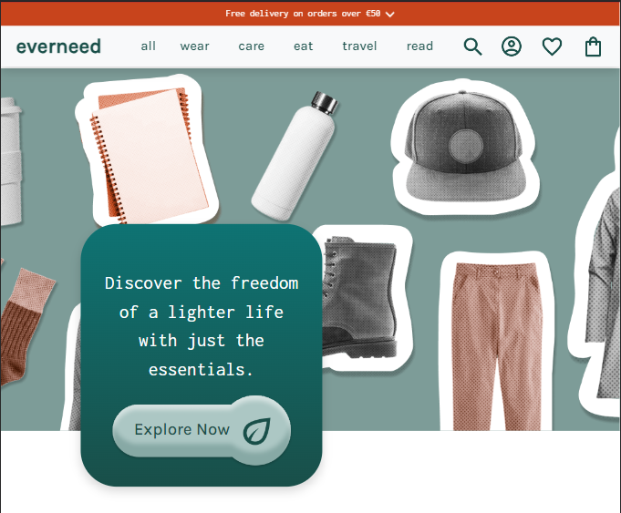
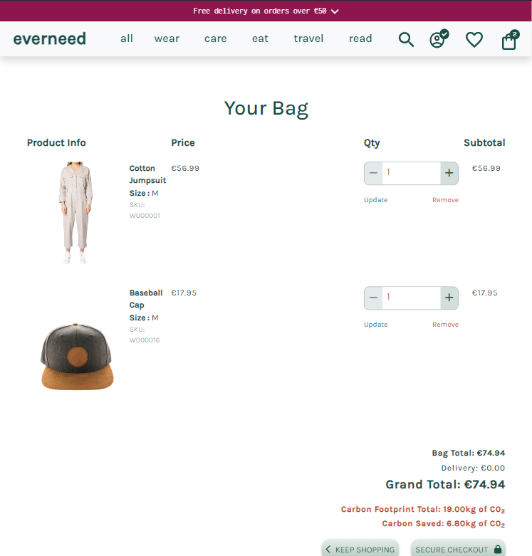
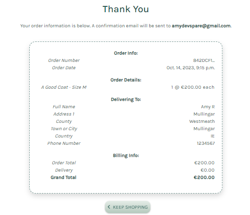
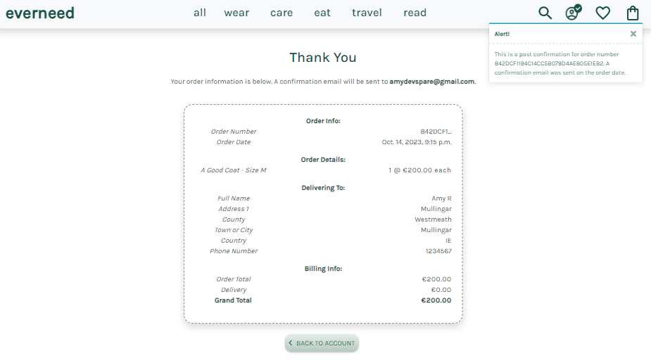

# everneed


## Introduction

Everneed is an e-commerce site selling practical, sustainable, earth-friendly products with a carbon-footprint total for your order. It has been developed as my Portfolio Project 5 for the Code Institute's Full Stack Software Developer Course using Django, HTML, CSS, JS & Python.

Everneed has been created using carbon data from available product carbon footprints, or [PCFs](https://tinyurl.com/2htnyr9w). As this data is relatively new, this website is to be viewed with the understanding that the data within is unvalidated, 'fictional' data, calculated to the best of my abilities from all available information on the internet. It's purpose is to purely aid in developing the website's concept.

With the growing threat of climate change and sudden mass displacement of large communities from natural disasters, there has never been a more important time, in recent years, to have a 'Go-Bag' ready for yourself and family members. The initial concept of this website was to introduce the idea of living with a minimum of necessary items, in an attempt to escape capitalism and free ourselves to be able to experience life and spend time with our loved ones. This concept could be a more grim, mandatory idea in the not-too-distant future, if all manufacturing of unnecessary goods were to cease in an sudden effort to meet a new global carbon emmissions target, since we have already shot through the [existing ones](https://www.unep.org/resources/emissions-gap-report-2022#:~:text=The%20world%20is%20not%20on,cent%20to%20avoid%20global%20catastrophe.).

Choosing to only purchase 100% necessary items, that have been created in the most sustainable way, and to be aware of your carbon spending at the same time, could be an e-commerce store type that will be with us sooner than we think. [Carbon credits](https://carboncredits.com/carbon-credits-explained-2023-guide/) are already being implemented in industrial and agricultural sectors in an effort to slow our global carbon emissions rate, it could, in the near future, start affecting our purchases as individuals.

View live site: [everneed](https://everneed-096aafe5d13c.herokuapp.com/)

If you wish to make a test purchase, you can use the following [Stripe Dummy Card](https://stripe.com/docs/testing) details:

- Success Card Number: 4242424242424242
- 3D Secure Auth Number: 4000 0027 6000 3184
- Exp Date: Any date in the future using the format MM/YY
- CVN: any 3 digit number
- Postcode: any 5 numerals  

Any payments made using a valid debit/credit card will not process and the card will not be charged. No orders made will be fulfilled.

For full Admin access to Django Admin panel with relevant sign-in credentials: [Everneed Admin](https://everneed-096aafe5d13c.herokuapp.com/admin/)

For access to Admin Dashboard frontend view with relebant sign-in credentials: [Everneed Admin Dashboard](https://everneed-096aafe5d13c.herokuapp.com/products/admin_dashboard/)

## Table of Contents

- [everneed](#everneed)
  - [Introduction](#introduction)
  - [Table of Contents](#table-of-contents)
  - [Overview](#overview)
  - [Customer Goals](#customer-goals)
  - [Business Goals](#business-goals)
- [UX/UI - User Experience/User Interface](#uxui---user-experienceuser-interface)
  - [Design Inspiration](#design-inspiration)
    - [Color Scheme](#color-scheme)
    - [Typography \& Iconography](#typography--iconography)
- [Project Planning](#project-planning)
  - [Strategy Plane](#strategy-plane)
    - [Carbon Footprint Planning](#carbon-footprint-planning)
    - [Site Goals](#site-goals)
  - [Agile Methodologies](#agile-methodologies)
    - [MoSCoW Prioritization](#moscow-prioritization)
    - [Sprints](#sprints)
  - [Marketing](#marketing)
  - [User Stories](#user-stories)
    - [Visitor User Stories](#visitor-user-stories)
    - [Epic - Home View \& User Account](#epic---home-view--user-account)
    - [Epic - Products](#epic---products)
    - [Epic - Basket Management \& Purchasing](#epic---basket-management--purchasing)
    - [Epic - Wishlist](#epic---wishlist)
    - [Epic - Newsletter](#epic---newsletter)
  - [Scope Plane](#scope-plane)
  - [Structural Plane](#structural-plane)
  - [Skeleton \& Surface Planes](#skeleton--surface-planes)
    - [Wireframes](#wireframes)
    - [Database Schema](#database-schema)
    - [Defensive Design](#defensive-design)
- [Features](#features)
  - [User View - Guests/Account Holders](#user-view---guestsaccount-holders)
  - [CRUD Functionality](#crud-functionality)
  - [Features Showcase](#features-showcase)
  - [Future Features](#future-features)
- [Technologies \& Languages Used](#technologies--languages-used)
  - [Libraries \& Frameworks](#libraries--frameworks)
  - [Tools \& Programs](#tools--programs)
- [Testing](#testing)
- [Deployment](#deployment)
  - [Connecting to GitHub](#connecting-to-github)
  - [Django Project SetUp](#django-project-setup)
    - [Elephant SQL](#elephant-sql)
  - [Heroku Deployment](#heroku-deployment)
  - [Google Mail Setup](#google-mail-setup)
  - [AWS Config](#aws-config)
    - [Media Folder Setup](#media-folder-setup)
    - [Django AWS Connect](#django-aws-connect)
  - [Stripe Config](#stripe-config)
  - [Clone Project](#clone-project)
  - [Fork Project](#fork-project)
- [Credits](#credits)
  - [Code](#code)
  - [Media](#media)
    - [Additional reading/tutorials/books/blogs](#additional-readingtutorialsbooksblogs)
  - [Acknowledgements](#acknowledgements)

## Overview
Everneed is an eco-friendly products store focusing on procuring the best in sustainabale, long-life products. Users are invited to:

- View the store as Guests
- Register for an Account
- Use the stores Wishlist feature to record liked products
- Browse products by category and price
- View, add and edit products in their bag
- Discover their carbon savings on certain items
- As registered users, view past orders
- Read the latest articles on climate change and environmental impacts
- Sign up for a weekly environment issues newsletters

Everneed is accessible via all browsers with full responsiveness on different screen sizes. It's aim is to raise awareness of our carbon spend and provide an alternative to the fast-fashion trap. 

## Customer Goals

Customers are provided with an easy, intuitive shopping experience and are encouraged to avail of sustainable, eco-friendly products. It is hoped that customers will sign up/register an account with everneed to be able to avail of the full range of user features. Customers are consistenly encouraged to make the best choices in terms of quality, environmentally friendly products. A sense of community is created with a weekly newsletter which will inform the customers of new products, trends and articles on everneed.

## Business Goals

Everneed provides easy Admin functionality for the business owner with an accessible, easy-use Admin Dashboard to manage inventory and articles. The additonal frontend forms allows the business owner to make quick and easy changes. Further information regarding users and orders can be accessed via the Admin Dashboard with a direct link to the information stored within the Django Admin Panel.

Everneed seeks to build a strong base of regular shoppers who seek long-life, quality products made from high quality, natural materials. The newsletter, articles and carbon footprint features aim to attract those who have concerns for the rising environmental issues that our planet faces. Further marketing is made through the businesses social media channels, in particular their Facebook page.

# UX/UI - User Experience/User Interface

## Design Inspiration

From the beginning of the project, I knew that the colour palette would reflect nature with shades of green acting as the primary colour, in particular forest green, #194f49. The website is kept clean, with good flow, using plenty of white space to draw attention to the products and the website's mission in reducing the carbon footprints of it's users.

A simple logo, created using [LogoAI](www.logoai.com) is used as a favicon and email branding logo. The logo depicts a plant trapped within a vault, as we must protect our environment at all costs.

  
*Everneed logo*

Only the necessary information is displayed so as to not increase the size of the website and it's own carbon footprint. Purple #8E164E and gold #CC4818 are used as accents to draw attention to active buttons and carbon totals. I created a hero image, using Figma and the site's product images, to add a modern, graphic edge to the website.


*Image created by myself in Figma using product images*

Product images are kept clean with no backgrounds so that focus is on the product itself. Feedback is continuously provided to the user via the website's header which displays whether the user is logged in and how many items are in their bag. Message 'toasts' are also visible upon user actions to display further information.

  
*Header feedback is kept clean and intuitive*

### Color Scheme


*Everneed Color Scheme*

Variables were used within the CSS file to call colours as they were needed:
- --forest: #194f49;
- --yellow: #ffc824;
- --bluegreen: #0e7373;
- --purple: #8E164E;
- --gold: #CC4818;
- --white: #fff;
- --black: #0d0d0d;

The above colours were chosen to reflect colours found naturally within nature. The primary, dominant colour of forest green #194f49, is used repretedly throught the website for it's font and main sectioning. A muted version is used for dashed borders for input field focus and feedback to the user, this replaces the default blue border used in most browsers. The main buttons are created using #e5ede8 in a gradient to a darker #b5c9bd. This creates a sense of depth and creates a 3D feel to the buttons.

  
*Everneed Main Button*

The purple is used when a button or field text is brought into focus by the user, this provides feedback that there is an action available in the feature/area. The gold is used to provide contrast for important text that provides a link and also in the 'Subscribe' button visible in the newsletter section of the footer area.White space is maintained throughout the website to keep it clean, clear and fresh.

Further preparation for the colour scheme was carried out on [Adobe Color](https://color.adobe.com/create/color-accessibility) to check for contrast levels and accessibility for those with sight issues. Text contrasts were checked also to ensure they exceeded the WCAG 2.1 Level for suitable contrast of web text.


  
*Everneed Color Accessibility Check*

  
*Everneed Color Contrast Check - Main*

  
*Everneed Color Contrast Check - Button*


### Typography & Iconography


*Everneed Font Pairing*

Karla and Inconsolata were both imported foom [Google Fonts](https://fonts.google.com/). They were chosen for their compatibility and aesthetics that aligned with the store brand. Karla is a sans-serif typeface with a clean and modern design which delivers a fresh and simple look to the store. Inconsolata is a monospace font which allows clear display of descriptions and information about the products. Together they apply enough textual contrast to allow for a good flow of information to the user, improving user experience. Using Google Fonts allows for faster, reliable loading times for the website, ensuring the user stays when they visit.

In development, 'Karla' was identified by variable ```--title```, whilst 'Inconsolata' was set as ```--main-font``` within the CSS file. Similar to my setup for the project's colours, using variables helped to speed up the frontend process.

# Project Planning

## Strategy Plane

The primary objective was to create an e-commerce store that satisfied the assessment criteria of the Code Institute's Project 5: E-Commerce Module. The store must provide the expected functions of a responsive e-commerce store using Stripe as a payment system, user/guest views for authentication and store features, some extra features of my choosing, wishlist and articles, and demonstration of some marketing/SEO skills. Orders on Everneed were to display the carbon footprint totals and carbon saved, (where data is available, see below), reflecting the pressing need for eco-consciousness in these modern times. The User, whether paying customer or just browsing, must receive the best in UX and feel that Everneed is relatable and trust-worthy. 

The site's design and graphic assets were collected through various copyright-free image websites. Images were edited for the wesite to be cohesive. The hero-image on the home page and above, was created by myself in Figma. Bootstrap and Cripsy Forms were used for the project's frontend to speed up the process and to keep the templates consistent. Further customisation to the buttons, forms, modals, toasts and user feedback processes were added to the project's CSS files. 

If a customer chooses to make a purchase then they are given consistent feedback through the use of 'toasts' messages and confirmation emails. The purchasing process is presented using Stripe payment handlers, obtained and setup using [Stripe's](https://stripe.com/docs) documentation and website.

### Carbon Footprint Planning
I spent a large portion of my project planning and researching to ensure that I would have sufficient product carbon footprint data available to me. This was so I could set up the carbon footprint total for the bulk of my store items. Carbon totals were calculated through my assessment of research materials and articles about carbon footprints and industry responsibilities. The values contained in the project are to be treated as approximate and are as follows:

  
*Carbon Footprint Data Calculations-Part 1*  
  
  
*Carbon Footprint Data Calculations-Part 2*

### Site Goals

- Site provides enjoyable experience for shoppers.
- Customers are educated about carbon footprints/credits/sustainable products through the checkout process and through reading the site articles and FAQ's.
- Customers feel informed that they are making a good choice shopping with Everneed.
- UX remains similar across screen sizes.
- CRUD functionalities work as intended with easy to user frontend forms.
- Scalable site to allow for extra features in the future.

## Agile Methodologies

Everneed followed Agile planning methodolgies to it's completion. [GitHub Projects](https://github.com/users/amylour/projects/6) provided an ideal platform to create issues, boards and milestones for each of the projects Epics. Using labels I could easily identify my next task and organise them into the appropriate Milestones and Sprints. Keeping focused on individual sections as I built Everneed reduced the number of bugs and human errors.

### MoSCoW Prioritization

I chose to follow the MoSCoW Prioritization method for Everneed, identifying and labelling my:

- **Must Haves**: the 'required', critical components of the project. Completing my 'Must Haves' helped me to reach the MVP (Minimum Viable Product) for this project. 
- **Should Haves**: the components that are valuable to the project but not absolutely 'vital' at the MVP stage. The 'Must Haves' must receive priority over the 'Should Haves'.
- **Could Haves**: these are the features that are a 'bonus' to the project, it would be nice to have them in this phase, but only if the most important issues have been completed first and time allows.
- **Won't Haves**: the features or components that either no longer fit the project's brief or are of very low priority for this release. 

### Sprints

My Sprints were broken down into appropriately sized chunks from the beginning and I followed them to the best of my abilities. It is difficult to quantify the time taken exactly for each sprint as running a busy household outside of the course meant the hours the project was completed in hours outside of the normal working week. I have done my best to record them below. They are representative of a general timeframe of focus on the project areas.

| Sprint No. | Sprint Content | Start/Finish Dates |
|------------|----------------|--------------------|
|    # 1     | Project Setup  |   01/08/23 - 20/08/23   |
|    # 2     | AllAuth & Basic Naviagtion |  20/08/23 - 22/09/23  |
|    # 3     | Product Views & CRUD       |  22/09/23 - 02/09/23  |
|    # 4     | Shopping Bag Functionality & Styling | 02/09/23 - 15/09/23   |
|    # 5     | Wishlist Feature   |   15/09/23 - 17/09/23       |
|    # 6     | Carbon Footprint & Articles  |  17/09/23 - 22/09/23   |
|    # 7     | Admin Dashboard        |  22/09/23 - 26/09/23    |
|    # 8     | User/Customer Correspondence  |  26/09/23 - 02/10/23   |
|    # 9     | Documentation & Testing   |    02/10/23 - 15/10/23   |

## Marketing

An [Everneed Facebook Page](https://www.facebook.com/profile.php?id=61552368530738) was created to demonstrate promotion of the Everneed store on social media. Posts informing customers of deals and new products would be made on the page with the hopes of drawing in more revenue. Facebook provides an easy, minimal-step process to allow business owners to promote their business, with additional paid 'boost' features to further promote and spread the reach of the posts. Everneed also offers a newsletter subscription service through MailChimp. The benfit of both of these services is that the customer is not forced to sign up to either and potentially worry that they will be spammed with an unnecessary amount of information. Everneed avoids this in order to keep it's brand clean and uphold it's eco-friendly efforts. 

Within the head's meta tags of the base template are researched keywords and a description of Everneed's goal as a business. These keywords have been researched using[Wordtracker](https://www.wordtracker.com/) to ensure that both short-tail and long-tail keywords are included. Keywords such as 'carbon-neutral', 'zero waste' and 'practical products' aim to reach most of the market, with additional descriptive key phrases such as 'buy longlife products' and 'buy once products' to craw in users who know exactly what type of product they are looking for. Important keywords like 'Vegan', 'Organic' and 'Bamboo' are present in the product names in the hope to catch a chance to appear at the top of the customers' Google searches.

In addition to this, sitemap.xml and robots.txt files are included to increase the sites visibility. Theses files are essential for SEO (Search Engine Optimisation). The sitemap.xml was generated using [XML Sitemap](https://www.xml-sitemaps.com/) and included in the root folder of the project. A robots.txt file was created in the root folder to instruct search engine crawlers on how to access and crawl the site's pages.


*Everneed Facebook Business Page*

## User Stories

User stories and features were recorded and managed on [GitHub Projects](https://github.com/users/amylour/projects/6)

### Visitor User Stories

| User Story | Priority |
|------------|------------------|
| As a **customer**, I can **view the site's home page** so that I can **understand the site's intentions and purpose**. | **MUST HAVE** |
| As a **customer**, I can **see and use the navigation bar** so that I can **make my way around the site and get to where I would like**. | **MUST HAVE** |
| As a **customer**, I can **enter text into the search bar** so that I can **search for a specific item**. | **MUST HAVE** |

### Epic - Home View & User Account

| User Story | Priority |
|------------------|---------------------|
| As a **customer** I can **create and manage an account with Everneed** so that I can **keep my personal details, order history and speed up my checkout process**. | **MUST HAVE** |
| As a **customer**, I can **edit my personal details on my account** so that I can **keep them up to date**. | **MUST HAVE** |
| As a **site user**, I can **enter my login details** so that I can **login in to my account**. | **MUST HAVE** |
| As a **site user**, I can **click on the visible links in the footer** so that I can **view the relevant information and destinations**. | **MUST HAVE** |
| As a **site user**, I can **register my email and receive a validation link via email** so that I can **create an account with everneed to track my spending and purchases**. | **SHOULD HAVE** |
| As a **customer**, I can **use the Contact Us form** so I can **send a message to the business/site admin**. | **SHOULD HAVE** |

### Epic - Products

| User Story | Priority |
|------------------|---------------------|
| As a **site user** I can **interact with sorting and view features on the 'All Products' page** so that I can **improve my shopping experience on the site**. | **MUST HAVE** |
| As a **site user**, I can **click on a navbar item for a specific category** so that I can **choose to view a smaller amount of related products**. | **MUST HAVE** |
| As a **customer**, I can **choose an individual product** so that I can **view its description, price, colours, sizes available etc**. | **MUST HAVE** |
| As a **site admin** I can **add a product to my inventory using a frontend from** so that I can **increase my range/amount of products available on site**. | **MUST HAVE** |
| As a**site admin**, I can **edit existing inventory from a frontend form** so I can **change the quantity of stock, sizes, colours or edit products description, price or image**. | **MUST HAVE** |
| As a **site admin**, I can **delete product from the inventory using a frontend form** so that I can **remove it from sale**. | **MUST HAVE** |

### Epic - Basket Management & Purchasing

| User Story | Priority |
|------------------|---------------------|
| As a **customer** I can **create and manage an account with everneed** so that I can **keep my personal details, order history and speed up my checkout process**. | **MUST HAVE** |
| As a **customer**, I can **click on 'Add to Bag' in my product view**so that I can **add the product to my bag**. | **MUST HAVE** |
| As a **customer**, I can **increase/decrease/remove quantities of a product in my bag** so that I can **have control over what I wish to purchase**. | **MUST HAVE** |
| As a **customer**, I can **view my bag total from any page** so that I can **keep track of my potential spending**. | **MUST HAVE** |
| As a **customer**, I can **view my running total of carbon saved when I add products** so that I can **see how much carbon my purchases would had saved in their production vs non eco-friendly products of the same type**. | **MUST HAVE** |
| As a **customer**, I can **view my total carbon footprint saving on checkout and it's associated climate impact/lifestyle changes** so that I can **understand the equivalent value of carbon saved versus purchasing the same non eco-friendly products**. | **MUST HAVE** |
| As a **customer**, I can **checkout my products securely** so that I can **complete my purchase**. | **MUST HAVE** |
| As a **customer**, I can **receive an email after purchasing** so that I can **confirm my purchase and keep a record of my order**. | **MUST HAVE** |
| As a **site user** I can **view error pages with 'Home' links** so that I can **return to the main page if a page is missing or forbidden**. | **MUST HAVE** |

### Epic - Wishlist 

| User Story | Priority |
|------------------|---------------------|
| As a **logged-in user** I can **click the 'Add to Wishlist' button** so that I can **keep a record of my favourite items**. | **COULD HAVE** |
| As a **logged-in user** I can **click the 'Remove' icon beside my Wishlist item** so that I can **remove that product from my Wishlist**. | **COULD HAVE** |

### Epic - Newsletter

| User Story | Priority |
|------------------|---------------------|
| As a **customer**, I can **enter my details into the newsletter form** so I can **receive emails about products or environmental issues/climate saving tips**. | **SHOULD HAVE** |

## Scope Plane

To focus on the learning of the Stripe API and webhook handlers that would ultimately drive the inner workings of the project, I kept my Everneed scope lower than my previous project, FreeFido. A working e-commerce store was essential so I intially planned to keep to the MVP to ensure that I would complete the project successfully. Especially with the project being my final one for this Diploma, a rigorous year of learning left me ecstatic with my progress but cautious not to fall at the final hurdle from fatigue. However through the planning stages I realised that I wanted to push further with the theme of an eco store and introduce carbon footprint as a currency that we may see in the future in the form of carbon credits.

Adding an Articles feature posted solely by the Admin of the website felt important to give more information to the customers on climate-change and manufacturing processes and their environmental impacts. An additional Wishlist feature would complement the site as some of the items have a higher price point due to their robust and eco-friendly manufacturing processes and longevity and the customer may like to purchase them at a later date. 

Django's MVT framework allowed these features to be built quickly and addition of an Admin frontend panel for managing products and articles created a robust e-commerce site that could start taking orders tomorrow.

Essential features were:
- User Accounts with AllAuth
- Payment system with Stripe
- Articles creation and management - Full CRUD
- Product inventory management - Full CRUD
- Shopping UX with Bag and Checkout processes - Full CRUD
- Site responsivity
- Business details to inform the user
    
## Structural Plane

Everneed is built using Bootstrap, with Code Institute's Boutique Ado e-commerce project as it's foundation. However, I picked apart the structure and styling to fit my own vision and changed quite a bit of the code. In particular I simplified the navbar and made the delivery banner a dropdown source of information, as is common with many modern e-commerce applications. Icons were sourced from Fontawesome and Flaticon through the wireframing process in Figma. The typography was chosen to give a clean, strong reading experience for the user. The Everneed icon was used as the Favicon. This is also repeated through the newsletter email.

A dashed #194f49 2px border is used for form fields throughout the project to replace browsers default blue highlight. Form validation has been left with it's original styling as no change was needed. Bootstrap allowed for easy transition between screen sizes as many ecommerce purchases are made using our mobiles, so this was a priority focus. Bootstrap components such as forms, an accordian section and a product carousel rasied the spec of the project, to give it a professional finish.

## Skeleton & Surface Planes

### Wireframes

[Figma](https://www.figma.com) was used to create basic wireframes for Everneed. I had a vision of what the site would look like from the beginning so the planning process went smoothly. Figma allows easy creation of wireframes to the appropriate frame sizes for different screens. Addition of icons and extra design features is easy with their Plugins component which can connect to Flaticon for example.

<details open>
    <summary>Desktop/Tablet Home Page Wireframe</summary>  
      
</details>

<details>
    <summary>Mobile Home Page Wireframe</summary>  
      
</details>

<details>
    <summary>Mobile Home Page Wireframe</summary>  
      
</details>

<details open>
    <summary>Desktop/Tablet/Mobile All Products Page Wireframe</summary>  
      
</details>

<details open>
    <summary>Desktop/Tablet Product Page Wireframe</summary>  
      
</details>

<details>
    <summary>Shopping Bag Wireframe</summary>  
      
</details>

<details>
    <summary>Bag Contents Toast Wireframe</summary>  
      
</details>

<details open>
    <summary>Mobile Menu & Auth Pages Wireframe</summary>  
      
</details>

<details>
    <summary>Desktop Register Page Wireframe</summary>  
      
</details>

<details>
    <summary>Desktop SignIn Page Wireframe</summary>  
      
</details>

<details>
    <summary>Desktop SignOut Wireframe</summary>  
      
</details>

### Database Schema

  
*Database Schema (ERD) for Everneed displaying relationships between feature components saved within the database*

[Lucidchart](https://www.lucidchart.com/pages/) was used to create the ERD(Entity RElationship Diagram) for Everneed. To satisy the assessment criteria, multiple models were created to personalise the Everneed project. These include:
- **Articles**: Articles may be added by Admin with image and text fields within the Add/Edit Article forms.
- **Order**: Carbon Footprint total and Carbon Saved Total have been added to the Boutique Ado Order model to handle the carbon total logic. This logic duplicates the product adding/updating/quantity logic within the bag contexts to allow for the carbon footprint to be calculated for products that had some form of data available to me to calculate approximate values.
- **Product**: Carbon Footprint and Carbon Saved have been added to the Boutique Ado Product model to handle the carbon total logic. The Admin can enter these values into the Product Management forms to be made available for the bag/checkout logic to process them.
- **Wishlist**: The Wishlist model takes simple values of the connected user and the product id to display the tiems in a list fr the individual user.

Future Feature models are visible in the ERD for Reactions, Reviews and Discount Codes. These will be encorporated into the next version of Everneed. At the moment they are beyond the MVP.

### Defensive Design

Everneed was developed to ensure a reliable user experience. It's intention was to cause no frustrations for the users and to ensure they return to make further purchases.

- Django AllAuth for user registration/log in/log out
- Input validation and error messages provide feedback to the user to guide them towards the desired outcome. 
- Unregistered users are diverted to the Sign Up page from restricted access pages. 
- Authentication processes control edit/delete icons to reveal them to the Admin only, this is further secured through accessing of CRUD functionalities in the Admin Dashboard. 
- Deletion of data is confirmed through an additional modal, double-checking with the user.
- Error pages are displayed with 'Home' buttons to help users get back on track. 
- Testing and validation of features completes the process.

**CSRF Tokens**

CSRF (Cross-Site Request Forgery) tokens are included in every form to help authenticate the request with the server when the form is submitted. Absence of these tokens can leave a site vulnerable to attackers who may steal a users data.

# Features

## User View - Guests/Account Holders

| Feature   | Guest | Registered, Account Holder |
|-----------|-------------------|-----------------|
| Home Page | Visable           | Visable         |
| Account  | Not Visible - 'Account' option only appears for registered, logged-in users | Visable and full feature interaction available |
| All Products  | Visable - items can be viewed and added to Bag, Wishlist function not available | Visable and full feature interaction available |
| Categories   | Visable - items can be viewed and added to Bag, Wishlist function not available | Visable and full feature interaction available |
| Read   | Visable | Visable |
| Search  | Visable | Visible |
| Contact Us/Newsletter | Visible | Visible |
| Admin Dashboard | Not Visible | Only visible to Admin |

## CRUD Functionality

Customers have full CRUD functionality with their prospective purchases. They may edit their bag, add more items or remove all items. They may also edit their delivery details if they are registered, logged-in users. Everneed Admin have access to the Admin Dashboard which allow them full CRUD over Product Management and Article posting.

| Feature | Create | Read | Update | Delete |
|---------|--------|------|--------|--------|
| Account | On registration | Yes, delivery details and order history | Yes, update address | No, users are unable to delete their accounts, this is restricted to Admin |
| Bag | Yes, customers may add to their bag | Yes | Yes, items can be added/removed | Yes |
| Products | Yes, Admin only | Yes, all users | Yes, Admin only | Yes, Admin only |
| Articles | Yes, Admin only | Yes, all users | Yes, Admin only | Yes, Admin only |

## Features Showcase

**Header & Navigation - All Users**

*For features showcase, screenshots of the features in use were taken on Laptop/iPad Pro/iPhone 12 Pro*

Everneed's navbar is kept clean, with a simple dropdown menu for the 'All Products' section. 
- The search icon yields a search modal when clicked.
- The profile icon changes to reflect the logged in/out status of the user.
- The heart icon takes the user to the wishlist, if logged in, otherwise they will be directed to the log in page.
- The bag displays the number of items within it if the customer adds an item to it.

The navbar is displayed via a dropdown toggle in mobile view.

<details open>
    <summary>Header & Navigation - All Users</summary>  
      
</details>

<details open>
    <summary>Header & Navigation Menu Demo</summary>  
      
</details>

<details open>
    <summary>Header & Navigation Mobile View</summary>  
      
</details>

**Home Page - All Users**

The Everneed Home Page invites the user in with a large hero graphic, designed in Figma by myself using product images. An 'Explore Now' button brings the user straight to the 'All Products' page. On scrolling down, the bestsellers section is visible in a carousel fashion that displays four products at a time. The Admin has the option to select the 'Featured Item' box in the Admin Product CRUD view. Additonal side arrows allow the user to cycle forwards and backwards through the items at their pace. When clicking the product image the customer is brought to the product page.

Below this is the Mission section with a smooth scroll animation fade-in and underline when the user moves down the flow of the page. Here the customer can identify the business's core values.

A simple accordian section for business FAQ's follows this. Answering a braod spectrum of possible customer questions.

<details open>
    <summary>Home Page - All Users</summary>  
      
</details>

<details open>
    <summary>Home Page: Bestsellers Carousel Demo</summary>  
      
</details>

<details>
    <summary>Home Page: Mission Section - All Users</summary>  
      
</details>

<details>
    <summary>Home Page: FAQ Section - All Users</summary>  
      
</details>

**Delivery Banner - All Users**

This dropdown banner is inspired by Patagonia's colourful dropdown banner. I wished to replicate it and I was happy with the outcome. Extra delivery and contact information is displayed to the user when the dropdown arrow is clicked. The webpage that the user was currently visiting is blurred otu and click is disabled outside the delivery banner area. Clicking the x in the top right corner returns the delivery banner back upwards to the top and the blur is removed from the webpage. When extended or in place at the top of the screen, the banner cycles through a selection of the Everneed design palette colours.

<details open>
    <summary>Delivery Banner - All Users</summary>  
      
</details>

**Search - All Users**

The search icon when clicked presents the user with a search modal that will take the user's input and return the relevant products. If that product is not available then the search result informs the user that there are '0' products with that name.

<details open>
    <summary>Search - All Users</summary>  
      
</details>

**All Auth - All Users who wish to create an account**

Django AllAuth provides a comprehensive, customisable authentication system that keeps user data safe. If a customer wishes to register an account they may enter their username and email and password x 2 to ensure precision. Upon submitting the form the user will receive an email to validate their email and then sign in to Everneed. Similar to all form fields throughout the site, I have applied my own styling to keep in line with Everneed's design. The log in page is similar to the register page with the log out page presenting the user with two buttons to continue the log out process or to return home.

Feedback is continually released to the user through toast messages to confirm successful registration, log in and log out.

AllAuth handles password reset by sending an email to the user with a link to change their password to something new.

<details open>
    <summary>Register - All Users</summary>  
      
</details>

<details open>
    <summary>Confirm Email - All Users</summary>  
      
</details>

<details>
    <summary>Log In - All Users</summary>  
      
</details>

<details>
    <summary>Log In Toast - Registered, Verified Users</summary>  
      
</details>

<details>
    <summary>Log Out - All Users</summary>  
      
</details>

<details>
    <summary>Password Reset - All Users</summary>  
      
</details>

<details>
    <summary>Password Success - All Users</summary>  
      
</details>

**Account - Registered, logged in User**

The Account page for Everneed is kept simple, with only relevant information and functionality. The registered, logged in user may adjust their personal, delivery address to be autofilled into their checkout form when making a purchase. Previous purchases are displayed in the Order History, displayed by most recent date.

<details open>
    <summary>Account Toast - Registered, logged-in Users</summary>  
      
</details>

<details open>
    <summary>Account View - Registered, logged-in Users</summary>  
      
</details>

**All Products - All Users**

Everneed sells a curated list of products, selected because of their sustainable production values and natural materials. Products with natural, sustainable materials such as organic wool, bamboo, vegan leather and cotton are available to the customer. Eco-labels will identify these materials quicker to the customer in future versions of Everneed. Clothes are presented as ungendered.

The product list and product details pages are kept responsive and neat thanks to Bootstraps grid system to collapse the rows into single columns. A 'Back to the Top' button appears in the bottom right corner of the webpages if the user has scrolled more than 20 pixels from the top of the screen. Only essential information is displayed with size options broken into three categories for clothes, accessories and shoes.

Products may be sorted according to price, A-Z, rating and category using the dropdown sort field.

Admin may access the Admin Dashboard to add/edit/delete any items within the database. Crispy Forms renders the adding/editing forms with some extra styling from myself to remove the default blue highlight border and replace it with a green dashed border to fit within the project's design. Border radius of 15px is added to round the form fields and buttons are styled to be similar across the website.

No information is lost when viewing the website on mobile view. All screen sizes display the same information to give all users the same experience.

<details open>
    <summary>All Products Desktop - All Users</summary>  
      
</details>

<details>
    <summary>All Products Mobile - All Users</summary>  
      
</details>

<details open>
    <summary>Product Detail Desktop - All Users</summary>  
      
</details>

<details>
    <summary>Product Detail Mobile - All Users</summary>  
      
</details>

<details>
    <summary>Admin Product List - Logged-In, Admin only</summary>  
      
</details>

<details>
    <summary>Admin Add Product Form - Logged-In, Admin only</summary>  
      
</details>

<details>
    <summary>Admin Edit Product Form - Logged-In, Admin only</summary>  
      
</details>

<details>
    <summary>Admin Confirm Delete - Logged-In, Admin only</summary>  
      
</details>

**Categories - All Users**

Everneed keeps it's shopping experience clean and easily accessible with four categories:
- Wear for clothing, accessories and footwear
- Care for personal care items
- Eat for food and drink items
- Travel for bags and travel items

'All' displays all of the products available. Icons from FontAwesome, below the product images, show which category the item is from.

<details>
    <summary>Everneed Categories - All Users</summary>  
      
</details>

**Articles - All Users/Admin CRUD**

The articles currently displayed on Everneed are informing customers of the ecological, environmental and climate issues our planet is currently facing. The text within the article has been created by Chat GPT when prompted to respond about natural disasters that the world has been facing. The Admin have sole responsibility to add/edit/delete articles with no current option for the customer/reader to respond or engage with the post. This is partly because the brand aims to engage the customer into making a purchase to better the planet, by choosing sustainably-produced, long-life products.

The Admin may add/edit/delete articles via the Admin Dashboard. If no image is included int he form or if the image url brekks, a placeholder image is present so as not to display a broken image link. Deletion is confirmed via a confirm deletion modal. When adding an article, the Admin may choose to save the article to drafts or publish them immediately. Drafts are accessible via the django backend panel and are published by selecting the published checkbox.

<details open>
    <summary>Articles List - All Users</summary>  
      
</details>

<details open>
    <summary>Individual Article View Desktop - All Users</summary>  
      
</details>

<details>
    <summary>Individual Article View Mobile - All Users</summary>  
      
</details>

<details open>
    <summary>Articles List Edit/Delete View - Admin only, accessed via Admin Dashboard</summary>  
      
</details>

<details>
    <summary>Add Article Form Mobile View - Admin only, accessed via Admin Dashboard</summary>  
      
</details>

<details>
    <summary>Articles Edit Form Mobile View - Admin only, accessed via Admin Dashboard</summary>  
      
</details>

<details>
    <summary>Articles Delete Confirmation Modal - Admin only, accessed via Admin Dashboard</summary>  
      
</details>

**Bag - All Users**

Everneed's Shopping Bag feature is presented in a clean and clear format to correctly and quickly inform the user of their possible purchase choices. The customer has the option to change the amounts of the items that they wish to buy or to remove them completely form the bag. The customer is shown their running totals as well as their delivery charge and their carbon saved and carbon footprint total. When products are added/updated/removed to/from the bag, then a toast message displays to give the customer feedback on their most recent choice.

A clear message is shown if there are no items in the bag and a 'Keep Shopping' button redirects the user back to the 'All Products' page. A delivery threshold banner informs the customer how much more they need to spend to reach the free delivery threshold.

<details open>
    <summary>Bag Contents Desktop/Tablet - All Users</summary>  
      
</details>

<details>
    <summary>Bag Contents Mobile - All Users</summary>  
      
</details>

<details>
    <summary>Bag Toast Message displaying Bag Contents</summary>  
      
</details>

<details open>
    <summary>Bag Toast Delivery Threshold message - All Users</summary>  
      
</details>

<details>
    <summary>Bag Empty - All Users</summary>  
      
</details>

**Checkout - All Users**

The checkout process for Everneed is operated through the [Stripe](https://stripe.com/docs) API. As stated above -> If you wish to make a test purchase, you can use the following [Stripe Dummy Card](https://stripe.com/docs/testing) details:

- Success Card Number: 4242424242424242
- 3D Secure Auth Number: 4000 0027 6000 3184
- Exp Date: Any date in the future using the format MM/YY
- CVN: any 3 digit number
- Postcode: any 5 numerals  

Any payments made using a valid debit/credit card will not process and the card will not be charged. No orders made will be fulfilled.

When the customer has added items that they wish to purchase to their bag, they are given the option to proceed to 'Secure Checkout' to complete their order. This checkout form contains a personal, delivery/billing information form that will display previously entered details if the user is logged in and had previously ticked the box to save their details. The Stripe Payment form accepts the user's information and will inform them if they attempt to use an invalid card. Validation is also present in the delivery form area, to remind the user if they have not entered all of the relevant details.

The items the customer has chosen are visible on the right hand side of the webpage with their grand total and an additonal box to display the Carbon saved and Carbon footprint total for their order. If the customer has not satisfied the free delivery threshold of €50, then a delivery charge of 10% of the grand total will be added to cover the cost of delivery.

Once the Checkout form has been submitted, a loading spinner informs the user that their payment is processing. Stripe's webhook handlers make this process smooth as the payment may attempt 5 times before being unsuccessful overall. In the Developer's view in the Stripe Dashboard, developers can check the webhook and payment processes to confirm they are working correctly.

<details open>
    <summary>Stripe Webhook/Payment Successful - Admin</summary>  
      
</details>

<details open>
    <summary>Checkout Desktop - All Users</summary>  
      
</details>

<details open>
    <summary>Checkout Mobile - All Users</summary>  
      
</details>

<details>
    <summary>Checkout Stripe Form - All Users</summary>  
      
</details>

A confirmation email for the order is emailed to all customers. This details their spending amount and the date of their purchase. Their totals and item purchased are also visible in the checkout success page upon successful payment processing. If the user is logged in, they can view this order and all previous orders, if they were logged in at the time of purchase, in their account view.

<details>
    <summary>Confirmation Email for Purchases</summary>  
      
</details>

<details>
    <summary>Checkout Success - All Users who've made a purchase</summary>  
      
</details>

<details>
    <summary>Order History - All Users who've made a purchase witha registered, logged-in account</summary>  
      
</details>

**Wishlist - Registered, logged in Users only**

A Wishlist feature allows the logged in user to keep a list of their favourite products. When logged in, on viewing an individual product, the user will see the 'Add to Wishlist' button. When clicked user is informed via toast message that product has been added successfully or whether the product already exists within the Wishlist. The heart icon in the navbar, when hovered displays the 'Wishlist' tooltip, and when clicked brings the logged in user to the wishlist page. If not logged in, when clicked it brings the user to the 'Log In' screen.

The Wishlist is a simple list display with a 'Remove Item' icon and text aside the product. There is no delete confirmation modal as this action is not a permanent deletion action, so is easily rectified if the product is accidentally removed from the list. When the item image is clicked the user is brought to the product detail page where they may add the item to their bag. The item is not automatically deleted from the wishlist if the user adds it to the bag.

<details open>
    <summary>Wishlist Button - Registered, logged-in Users only</summary>  
      
</details>

<details open>
    <summary>Wishlist Page Desktop - Registered, logged-in Users</summary>  
      
</details>

<details open>
    <summary>Wishlist Page Mobile - Registered, logged-in Users</summary>  
      
</details>

**Admin Dashboard - Logged in Admin/Superuser only**

When developing this project it was important to me to have a separate Admin area accessible via the frontend, in addition to the Django Backend Panel. I fulfilled this by separating out the CRUD features for the Admin/Superuser into an Admin Dashboard. This provides a direct link to editable forms for adding/editing products and articles. A separated 'Admin' view (viewable only to the Admin when they are logged in) has been created for Articles and Products with lists that display 'Edit' and 'Delete' Buttons. The 'Add' buttons bring the Admin directly to adding products or articles. Crispy Forms and Summernote render forms that allow for a high degree of editing, manipulation and connection to the database models. Defensive design for deletion of items appears in the form of a 'Delete Confirmation' modal.

<details open>
    <summary>Admin Dashboard View - Admin Only</summary>  
      
</details>

<details open>
    <summary>Admin Django Backend Panel - Admin Only</summary>  
      
</details>

**Footer - All Users**

Everneed's footer is brightly coloured with the defaulyt forest green #194f49 to contrast against the site's important white space. A purple SVG presents the newsletter subscription form for users to sign up for weekly emails. Across from this are a list of links that aim to give the customer all of the information they would need about Everneed. FAQ links the user back to the home page's accordian section of the usual questions and answers. Contact Us opens a contact modal for any queries that remain unanswered by the FAQ's. 

The stores Privacy Policy and Terms and Conditions follow underneath. The Privacy Policy opens in a new tab whilst the Terms and Conditions are displayed on a new Everneed webpage thanks to [Termly's](https://termly.io/) pasteable HTML block, once you have given the relevant business details. Finishing off that column are the business's Social Media connections. A Facebook page for Everneed opens in a new tab, as does my Twitter page containing a mix of climate change documents and web development articles. My LinkedIn and GitHub are also connected and will open in a new tab.

At the very bottom of the footer are the business's address which highlights in yellow when hovered and links to the Google Map for a generic address in Mullingar, the address for this fictional business. The copyright link when clicked brings the user to my project's README file.

<details open>
    <summary>Footer - All Users</summary>  
      
</details>

<details >
    <summary>Privacy Policy - All Users</summary>  
      
</details>

<details >
    <summary>Terms & Conditions - All Users</summary>  
      
</details>

**Contact Us - All Users**

A brief contact form is offered in the footer of Everneed for any queries the customer may have. One submitting their name, email and message, a thank you page is displayed, with a 'Return Home' button. The Admin may view the messages in their connected business email service and reply directly to the customer.

<details open>
    <summary>Contact Us Form - All Users</summary>  
      
</details>

<details open>
    <summary>Contact Form Thank You</summary>  
      
</details>

<details open>
    <summary>Contact Form Email</summary>  
      
</details>

**Newsletter - All Users who subscribe**

Everneed customers are invited to subscribe to Everneed's weekly eco newsletter. This form is located on every page in the footer. The newsletter service is offered through Mailchimp. The newsletter aims to keep customers informed of discounts, new products, sales and environmental issues on a weekely basis. On entering their email and clicking subscribe, the user is brought to a new page in a new tab confirming their subscription to Everneed. They may unsubscribe from here or from the bottom of the weekly newsletter.  

<details open>
    <summary>Everneed Newsletter Form</summary>  
      
</details>

<details>
    <summary>MailChimp Newsletter Sign Up Confirmation</summary>  
      
</details>

<details>
    <summary>MailChimp Newsletter Example</summary>  
      
</details>

**404 Page - All Users**

If a customer navigates to a page that does not exist eg 'everneed-herokuapp.com/test/' this page is displayed to the user. A 'Go Home' button takes the user back to the Home page.

<details>
    <summary>404 Error Page</summary>  
      
</details>

## Future Features

- **Stock Levels**: Editable stock levels are a priority future feature for Everneed. This will be added to the Admin Dashboard and the customer will be informed of stock levels via display labels if a product is out of stock.

- **Article Comment, Article React**: As the Article's feature is only added to/edited by Admin, I considered having some way for user's to interact with the content. Through it's development I decided that Article Comments would be a 'WON'T HAVE' issue as I felt that having that much of a social media feature would not suit the Everneed brand. I also considered a 'Reaction' feature which at the moment remains at 'COULD HAVE'. Having several eco-related emojis could be a possibility but I would want to ensure that they do not detract from the seriousness of the article's content.

- **Reviews feature with Ratings**: I hope to include a Reviews feature in Everneed's future development. I would like the customer's to have access to real-life reviews of the products' robustness, wear and materials. I feel that for the brand it is important for transparency to be front and centre to ensure customers make the best choice in their purchases, particularly with most of the products aiming to be non-gendered sizing. Reviews will have their averages calculated and this will determine the products' rating out of 5 when implemented.
  
- **Eco-Labels**:Further Categorise products with eco-labels for materials and production processes. This will further inform the customer of what exactly they are purchasing and will add to the carbon footprint feature.
  
- **Newsletter Discount Code**:Discount codes obtained through newsletter subscription will offer the customer a 10% discount on their first purchase if they subscribe to the newsletter distributed via MailChimp.

- **Sale Section**: Inclusion of a sale section for Admin to add stock that is ready to be offered at a discounted price.

- **Product Slugs**: Using Django-Slugify, the future version of Everneed will ensure that the products name is displayed in the URL.

# Technologies & Languages Used

- HTML
- CSS
- JavaScript
- Python
- [Git](https://git-scm.com/) used for version control.
- [Github](https://www.github.com) used for online storage of codebase and Projects tool.
- [CodeAnywhere](https://app.codeanywhere.com) as an online, cloud-based IDE for development.
- [Figma](https://www.figma.com) for project design planning and wireframe creation.
- [Adobe Color](https://color.adobe.com) for colour theme creation and accessibility checkers.
- [Django](https://www.djangoproject.com/) was used as the Python framework for the site.
- [Heroku](https://www.heroku.com) was used to host the 'everneed' application.
- [WAVE](https://wave.webaim.org/) to evaluate the accessibility of the site.
- [Procreate](https://procreate.com/) for image creation and editing.

## Libraries & Frameworks

Libraries and frameworks used were dictated by the 'Boutique Ado' walkthrough from our course material with the Code Institute. This project will be upgraded on completion of the course to more recent packages to meet current standards and security packages.

- [Django v3.2](https://docs.djangoproject.com/en/4.2/releases/3.2/) 
- [AllAuth v0.41](https://django-allauth.readthedocs.io/) for user authentication and account management.
- [Bootstrap v4.6](https://getbootstrap.com/docs/4.6/getting-started/introduction/) for template rendering.
- [Crispy Forms](https://pypi.org/project/crispy-bootstrap4/) for form rendering.
- [boto3](https://boto3.amazonaws.com/v1/documentation/api/latest/index.html) for AWS CRUD with Python scripts.
- [dj-database-url](https://pypi.org/project/dj-database-url/) for DATABASE_URL.
- [django-countries](https://pypi.org/project/django-countries/) for country field rendering in checkout form.
- [django-storages](https://django-storages.readthedocs.io/en/latest/) for handling static and media files.
- [django-summernote](https://pypi.org/project/django-summernote/) a WYSIWYG editor for Django forms and models.
- [gunicorn](https://docs.djangoproject.com/en/4.2/howto/deployment/wsgi/gunicorn/) apure-Python WSGI server for UNIX.
- [oauthlib](https://pypi.org/project/oauthlib/) OAuth request-signing logic.
- [psycopg2](https://pypi.org/project/psycopg2/) s PostgreSQL database adapter for Python.
- [Stripe](https://stripe.com/en-ie) for processing Everneed's payment system.

## Tools & Programs
- [ImageCompressor](https://imagecompressor.com/) for compressing PNG/WEbp files
- [Image ReSizer](https://www.simpleimageresizer.com/) for reducing image size
- [EZGif](<https://ezgif.com/>) for gif conversion.
- [Convertio](https://convertio.co/) for file conversion to PNG, WEBP.
- [Tiny Png](https://tinypng.com/) for file size reduction.
- [Lucidchart](https://www.lucidchart.com/pages) for ERD (entity relationship diagram) creation.
- [Favicon](https://favicon.io/) for converting an icon into favicon.
- [amiresponsive](https://ui.dev/amiresponsive) for screenshot of Everneed on different screen sizes.
- [Perplexity AI](https://www.perplexity.ai/) for breaking down Python concepts and Django documentation into more understandable chunks.
- [Mailchimp](https://mailchimp.com/) is used for marketing with their newsletter subscription service.

# Testing

- For all testing, please refer to the [TESTING.md](TESTING.md) file.

# Deployment

## Connecting to GitHub  

To begin this project from scratch, you must first create a new GitHub repository using the [Code Institute's Template](https://github.com/Code-Institute-Org/ci-full-template). This template provides the relevant tools to get you started. To use this template:

1. Log in to [GitHub](https://github.com/) or create a new account.
2. Navigate to the above CI Full Template.
3. Click '**Use this template**' -> '**Create a new repository**'.
4. Choose a new repository name and click '**Create repository from template**'.
5. In your new repository space, click the purple CodeAnywhere (if this is your IDE of choice) button to generate a new workspace.

## Django Project SetUp

1. Install Django and supporting libraries:

- ```pip3 install 'django<4' gunicorn```
- ```pip3 install dj_database_url psycopg2``` 
  
1. Once you have installed any relevant dependencies or libraries, such as the ones listed above, it is important to create a **requirements.txt** file and add all installed libraries to it with the ```pip3 freeze --local > requirements.txt``` command in the terminal.  
2. Create a new Django project in the terminal ```django-admin startproject everneed .```
3. Create a new app eg. ```python3 mangage.py startapp home```
5. Add this to list of **INSTALLED_APPS** in **settings.py** - 'home',
6. Create a superuser for the project to allow Admin access and enter credentials: ```python3 manage.py createsuperuser```
7. Migrate the changes with commands: ```python3 manage.py migrate```
8. An **env.py** file must be created to store all protected data such as the **DATABASE_URL** and **SECRET_KEY**. These may be called upon in your project's **settings.py** file along with your Database configurations. The **env.py** file must be added to your **gitignore** file so that your important, protected information is not pushed to public viewing on GitHub. For adding to **env.py**:

- ```import os```
- ```os.environ["DATABASE_URL"]="<copiedURLfromElephantSQL>"```
- ```os.environ["SECRET_KEY"]="my_super^secret@key"```
  
For adding to **settings.py**:

- ```import os```
- ```import dj_database_url```
- ```if os.path.exists("env.py"):```
- ```import env```
- ```SECRET_KEY = os.environ.get('SECRET_KEY')``` (actual key hidden within env.py)  

9. Replace **DATABASES** with:

```
DATABASES = {
    'default': dj_database_url.parse(os.environ.get("DATABASE_URL"))
  }
```

10. Set up the templates directory in **settings.py**:

- Under ``BASE_DIR`` enter ``TEMPLATES_DIR = os.path.join(BASE_DIR, ‘templates’)``
- Update ``TEMPLATES = 'DIRS': [TEMPLATES_DIR]`` with:

```
os.path.join(BASE_DIR, 'templates'),
os.path.join(BASE_DIR, 'templates', 'allauth')
```

- Create the media, static and templates directories in top level of project file in IDE workspace.

11. A **Procfile** must be created within the project repo for Heroku deployment with the following placed within it: ```web: gunicorn everneed.wsgi```
12. Make the necessary migrations again.

### Elephant SQL

A new database instance can be created on [Elephant SQL](https://www.elephantsql.com/) for your project. 

- Choose a name and select the **Tiny Turtle** plan, which is free.
- Select your Region and the nearest Data Center to you. 
- From your user dashboard, retrieve the important 'postgres://....' value. Place the value within your **DATABASE_URL**  in your **env.py** file and follow the below instructions to place it in your Heroku Config Vars.

## Heroku Deployment

To start the deployment process , please follow the below steps:

1. Log in to [Heroku](https://id.heroku.com/login) or create an account if you are a new user.
2. Once logged in, in the Heroku Dashboard, navigate to the '**New**' button in the top, right corner, and select '**Create New App**'.
3. Enter an app name and choose your region. Click '**Create App**'.
4. In the Deploy tab, click on the '**Settings**', reach the '**Config Vars**' section and click on '**Reveal Config Vars**'. Here you will enter KEY:VALUE pairs for the app to run successfully. The KEY:VALUE pairs that you will need are your:

   - **DATABASE_URL**:**postgres://...**
   - **DISABLE_COLLECTSTATIC** of value '1' (N.B Remove this Config Var before deployment),
   - **SECRET_KEY** and value  
   - **AWS_ACCESS_KEY** and value
   - **AWS_SECRET_ACCESS_KEY** and value
   - **EMAIL_HOST_PASS** and value
   - **EMAIL_HOST_USER** and value
   - **STRIPE_PUBLIC_KEY** and value
   - **STRIPE_SECRET_KEY** and value
   - **STRIPE_WH_SECRET** and value
   - **USE_AWS** and value

5. Add the Heroku host name into **ALLOWED_HOSTS** in your projects **settings.py file** -> ```['herokuappname', ‘localhost’, ‘8000 port url’].```
2. Once you are sure that you have set up the required files including your requirements.txt and Procfile, you have ensured that **DEBUG=False**, save your project, add the files, commit for initial deployment and push the data to GitHub.
3. Go to the '**Deploy**' tab and choose GitHub as the Deployment method.
4. Search for the repository name, select the branch that you would like to build from, and connect it via the '**Connect**' button.
5. Choose from '**Automatic**' or '**Manual**' deployment options, I chose the 'Manual' deployment method. Click '**Deploy Branch**'.
6.  Once the waiting period for the app to build has finished, click the '**View**' link to bring you to your newly deployed site. If you receive any errors, Heroku will display a reason in the app build log for you to investigate. **DISABLE_COLLECTSTATIC**  may be removed from the Config Vars once you have saved and pushed an image within your project.

## Google Mail Setup

1. Setup a Gmail Account that will be used to hold and store the emails for your project.
2. Logged in, navigate to **Settings** -> **Other Google Account Settings** -> **Accounts** -> **Import** -> **Other Account Settings**
3. Activate 2-Step Verification
4. Once verified access **App Passwords** -> **Other** -> enter a name for the password, eg Everneed.
5. Click **Create** -> copy the 16 digit password that is generated.
6. In your `settings.py` add the following Email Settings:
     
   *Django Email Settings for Everneed Email setup*  
7. Add EMAIL_HOST_PASS, EMAIL_HOST_USER variable, password and email address to your Heroku Config Vars
    
## AWS Config

[AWS](https://aws.amazon.com) is used to store the media and static files online for Everneed. Please follow the below steps to set it up for yourself:

1. Setup AWS Account and Login
2. Create a new S3 Bucket -> name it to match your Heroku App name -> Choose the region closest to you.
3. Allow **Clock All Public Access**, tick 'Bucket will be public' in order for the bucket to connect to Heroku. 
4. In **Object Ownership** -> **ACLS Enabled** -> **Bucket Owner Preferred**.
5. **Properties** tab -> turn on static web hosting and add 'index.html' and 'error.html' into the correct fields -> click **Save**
6. In the **Permissions** tab, paste in the following CORS config:

   ```
	[
		{
			"AllowedHeaders": [
				"Authorization"
			],
			"AllowedMethods": [
				"GET"
			],
			"AllowedOrigins": [
				"*"
			],
			"ExposeHeaders": []
		}
	]
	```
7. Copy your **ARN** string.
8. From the **Bucket Policy** tab, select the **Policy Generator** link, and use the following steps:
	- Policy Type: **S3 Bucket Policy**
	- Effect: **Allow**
	- Principal: `*`
	- Actions: **GetObject**
	- Amazon Resource Name (ARN): **paste-your-ARN-here**
	- Click **Add Statement**
	- Click **Generate Policy**
	- Copy the entire Policy, and paste it into the **Bucket Policy Editor**

		```shell
		{
			"Id": "Policy1234567890",
			"Version": "2012-10-17",
			"Statement": [
				{
					"Sid": "Stmt1234567890",
					"Action": [
						"s3:GetObject"
					],
					"Effect": "Allow",
					"Resource": "arn:aws:s3:::bucket-name/*"
					"Principal": "*",
				}
			]
		}
		```
    - Before you click "Save", add `/*` to the end of the Resource key in the Bucket Policy Editor (like above).
	- Click **Save**.
9. In the **ACL - Access Control List** -> **Edit** -> enable **List** for **Everyone(Public Access)** -> Accept the warning.

### AWS - IAM setup

1. AWS Services Menu -> **Create New Group** -> add name eg. 'group-project-name'.
2. Navigate from there to **REview Policy** page -> **User Groups** -> Select newly named group.
3. Navigate to **Permissions** tab -> **Add Permissions** -> Click **Attach Policies**
4. Select policy -> **Add Permissions** at the bottom, click when finished.
5. From **JSON** tab -> select **Import Managed Policy** link -> search for **S3** -> select **Amazon3FullAccess** policy -> **Import**.
6. Copy **ARN** from S3 Bucket again ->

   ```
		{
			"Version": "2012-10-17",
			"Statement": [
				{
					"Effect": "Allow",
					"Action": "s3:*",
					"Resource": [
						"arn:aws:s3:::bucket-name",
						"arn:aws:s3:::bucket-name/*"
					]
				}
			]
		}
	```
7. Click **Review Policy** -> name eg. 'policy-everneed' -> enter a description -> **Create Policy**
8. Search for your new policy and click it to **Attach Policy**
9. **User Groups** -> **Add User** -> name eg. 'user-everneed'
10. For **Select AWS Access Type** -> select **Programmatic Access** -> Add group to 'user-everneed' -> **Review User** -> **Create User**.
11. Find **Download.csv** button to download immediately and save a copy.
    - This contains the user's **Access key ID** and **Secret access key**.
	- `AWS_ACCESS_KEY_ID` = **Access key ID**
	- `AWS_SECRET_ACCESS_KEY` = **Secret access key** 

### Media Folder Setup
1. In Heroku Config Vars, remove `DISABLE_COLLECTSTATIC`.
2. In AWS S3 create a new folder -> **media** -> Add project images -> **Manage Public Permissions** -> **Grant public read access to the objects** -> **Upload**

### Django AWS Connect

1. Packages needed to use AWS S3 Buckets in Django:
   - `pip3 install boto3`
   - `pip3 install django-storages`
2. In settings.py add:
   ```
   INSTALLED_APPS = [
       'storages',
   ]
3. In env.py ensure AWS variables are present for `AWS_ACCESS_KEY_ID`, `AWS_SECRET_ACCESS_KEY` and environment variable paths are in settings.py:
   ```
   import os
   from pathlib import Path
   import dj_database_url

   if os.path.isfile('env.py'):
   import env
   ```
4. Ensure DATABASES are set up to connect with Heroku Postgres server in production vs SQLite3 when in local development.
   ```
   if "DATABASE_URL" in os.environ:
	DATABASES = {
		"default": dj_database_url.parse(os.environ.get("DATABASE_URL"))
	}
    else:
	DATABASES = {
		"default": {
			"ENGINE": "django.db.backends.sqlite3",
			"NAME": os.path.join(BASE_DIR, "db.sqlite3"),
		}
	}
    ```
5. Setup media and static file storage in settings.py:
   ```
   STATIC_URL = "/static/"
   STATICFILES_DIRS = (os.path.join(BASE_DIR, "static"),)

   MEDIA_URL = "/media/"
   MEDIA_ROOT = os.path.join(BASE_DIR, "media")
   ```
6. S3 Bucket config in settings.py is as follows:
   ```
   if 'USE_AWS' in os.environ:
    # Cache control
    AWS_S3_OBJECT_PARAMETERS = {
        'Expires': 'Thu, 31 Dec 2099 20:00:00 GMT',
        'CacheControl': 'max-age=94608000',
    }

    # Bucket Config
    AWS_STORAGE_BUCKET_NAME = 'everneed-096aafe5d13c'
    AWS_S3_REGION_NAME = 'eu-west-1'
    AWS_ACCESS_KEY_ID = os.environ.get('AWS_ACCESS_KEY_ID')
    AWS_SECRET_ACCESS_KEY = os.environ.get('AWS_SECRET_ACCESS_KEY')
    AWS_S3_CUSTOM_DOMAIN = f'{AWS_STORAGE_BUCKET_NAME}.s3.amazonaws.com'

    # Static and media files
    STATICFILES_STORAGE = 'custom_storages.StaticStorage'
    STATICFILES_LOCATION = 'static'
    DEFAULT_FILE_STORAGE = 'custom_storages.MediaStorage'
    MEDIAFILES_LOCATION = 'media'

    # Override static and media URLs in production
    STATIC_URL = f'https://{AWS_S3_CUSTOM_DOMAIN}/{STATICFILES_LOCATION}/'
    MEDIA_URL = f'https://{AWS_S3_CUSTOM_DOMAIN}/{MEDIAFILES_LOCATION}/'
    ```
7. In the main project directory create a 'custom_storages.py' file and add the following:
   ```
     from django.conf import settings
  from storages.backends.s3boto3 import S3Boto3Storage

class StaticStorage(S3Boto3Storage):
	location = settings.STATICFILES_LOCATION

class MediaStorage(S3Boto3Storage):
	location = settings.MEDIAFILES_LOCATION
    ```
8. AWS S3 Bucket is now connected through the above settings and Heroku's Config Vars.

## Stripe Config

Stripe's API is used to handle Everneed's payment system. To setup follow the below steps:

1. Create and log in to a Stripe account.
2. In the Stripe Dashboard -> **Get your test API keys.**
3. Add your `STRIPE_PUBLIC_KEY` and `STRIPE_SECRET_KEY` to your env.py, connect to your settings.py using your environment variables and then enter them into your project's Heroku Config Vars.
4. Including Stripe's Webhooks creates a failsafe if a customer exits the page during payment authorisation. In Stripe's Dashboard -> **Developers** -> **Webhooks** -> **Add Endpoint**: 'herokuapp url/checkout/wh'
5.  Choose **Retrieve all events** -> **Add Endpoint**.
6.  Add new key **STRIPE_WH_SECRET** to env.py, settings.py and Heroku Config Vars as before.

## Clone Project

A local clone of this repository can be made on GitHub. Please follow the below steps:

1. Navigate to GitHub and log in.
2. The [Everneed Repository](https://github.com/amylour/everneed) can be found at this location.
3. Above the repository file section, locate the '**Code**' button.
4. Click on this button and choose your clone method from HTTPS, SSH or GitHub CLI, copy the URL to your clipboard by clicking the '**Copy**' button.
5. Open your Git Bash Terminal.
6. Change the current working directory to the location you want the cloned directory to be made.
7. Type `git clone` and paste in the copied URL from step 4.
8. Press '**Enter**' for the local clone to be created.
9. Using the ``pip3 install -r requirements.txt`` command, the dependencies and libraries needed for FreeFido will be installed.
10. Set up your **env.py** file and from the above steps for ElephantSQL, gather the Elephant SQL url for additon to your code and add your SECRET_KEY and STRIPE/AWS keys if using these services.
11. Ensure that your **env.py** file is placed in your **.gitignore** file and follow the remaining steps in the above Django Project Setup section before pushing your code to GitHub.

## Fork Project

A copy of the original repository can be made through GitHub. Please follow the below steps to fork this repository:  

1. Navigate to GitHub and log in.  
2. Once logged in, navigate to this repository using this link [everneed Repository](https://github.com/amylour/everneed).
3. Above the repository file section and to the top, right of the page is the '**Fork**' button, click on this to make a fork of this repository.
4. You should now have access to a forked copy of this repository in your Github account.
5. Follow the above Django Project Steps if you wish to work on the project.

# Credits

## Code

The following blogs/tutorials complemented my learning for this project, alongside the [Code Institute's](https://codeinstitute.net/ie/) Learning Content. The Portfolio Project 5 - Boutique Ado provided a foundation which I took apart and altered to fit my project's design

- [Django Docs](https://www.djangoproject.com/)
- [Bootstrap Docs](https://getbootstrap.com/docs/4.6/getting-started/introduction/)
- [Code Institute's](https://github.com/Code-Institute-Org>) Blog/Boutique Ado walkthroughs
- [Daisy McGirr's](https://www.youtube.com/@IonaFrisbee) easy to follow Django Recipe App tutorial for understanding how to use Django's MVT framework
- Remove blue highlight shadow from around input field when selected [StackOverflow](https://tinyurl.com/yk2uaf8c)
- Newsletter sign up template and SVG [Bootsnipp](https://bootsnipp.com/snippets/6XVAB)
- Change color of Bootstrap svg item using background image url [Codepen](https://codepen.io/noahblon/post/coloring-svgs-in-css-background-images)
- Bootstrap e-commerce carousel for 'Bestsellers/Featured Items' [GeekProbin](https://www.youtube.com/watch?v=8g9Glz5VlZo) & [colorlib](https://colorlib.com/wp/template/carousel-02/)
- Scroll fade in animation for 'Mission' section [Nucleio Tech](http://tinyurl.com/5c6d5nhy)
- Underline animation for 'Our Mission' section [Youtube](https://www.youtube.com/watch?v=wsDZm6PXeVw)
- Scroll to top button & hide/show button [devdevshow](https://devdevshow.com/back-to-top-button-scroll-button-css/)
- Change color of checkbox using 'accent' [CodeProject](https://tinyurl.com/jtecnb39)

## Media

- [Freepik](https://www.freepik.com) for images used within the site
- [Pexels](https://www.pexels.com/) for images used within the site
- [Unsplash](https://unsplash.com/) for images used within the site
- [Flaticon](https://www.flaticon.com) for icons used in wireframing and on the website
- [Chat GPT](https://www.chat.openai.com) was used to produce the content text for the Articles section prompted by myself with several talk points about climate change and current eco-issues.

<details>
<summary>Image credits are as follows:</summary>

- jumpsuit: https://www.freepik.com/free-photo/blonde-woman-beige-jumpsuit-with-design-space-streetwear-apparel-full-body-set_15476228.htm#query=cottonjumpsuit&position=1&from_view=search&track=ais?log-in=google
- shorts: https://www.freepik.com/free-photo/casual-men-short-pants_1135444.htm#query=trousers&position=4&from_view=autho
- green boots: https://www.freepik.com/free-photo/leather-boots_1135347.htm#query=boots&position=0&from_view=author
- brown boots: https://www.freepik.com/free-photo/leather-boots_1135371.htm#query=boots&position=4&from_view=author
- brown sandal: https://www.freepik.com/free-photo/beautiful-men-sandal_1123563.htm#query=sandals&position=13&from_view=author
- longsleeve: https://www.freepik.com/free-photo/t-shirt_1135214.htm#query=tshirt&position=12&from_view=author
- sunglasses: https://www.freepik.com/free-photo/sunglasses_1135982.htm#query=sunglasses&position=1&from_view=author
- baseball hat: https://www.freepik.com/free-photo/background-textile-protection-back-object_1095637.htm#query=hat&position=13&from_view=author
- tshirt: https://www.freepik.com/free-photo/white-shirt_9187460.htm#query=cotton%20t%20shirt&position=32&from_view=search&track=ais
- hoody: https://www.freepik.com/free-photo/black-hoodie-with-zipper_13237308.htm#query=zip%20up%20hoody&position=0&from_view=search&track=ais
- first aid kit: https://www.freepik.com/free-photo/flat-lay-health-still-life-arrangement-with-copy-space_12412903.htm#query=first%20aid%20kit&position=7&from_view=search&track=ais
- notepad: https://www.freepik.com/free-photo/top-view-notebooks-table_12062758.htm#query=notepad&position=0&from_view=search&track=sph
- backpack: https://www.freepik.com/free-photo/female-with-backpack-field_8741104.htm#query=backpack&position=20&from_view=search&track=sph
- daybag: https://www.freepik.com/free-photo/shallow-focus-shot-male-wearing-grey-brown-rucksack_11486735.htm#query=leather%20satchel&position=17&from_view=search&track=ais
- satchel: https://www.freepik.com/free-photo/shallow-focus-view-male-wearing-brown-leather-satchel_10606014.htm#query=leather%20messenger%20bag&position=3&from_view=search&track=ais
- water bottle: https://www.freepik.com/free-photo/white-reusable-water-bottle_19002897.htm#query=reusable%20water%20bottle&position=10&from_view=search&track=ais
- coffee cup: https://www.freepik.com/free-photo/front-view-hand-held-cup_6404799.htm#query=reusable%20coffee%20cup&position=24&from_view=search&track=ais
- torch: https://www.decathlon.ie/torches/325763-140976-autonomous-torch-dynamo-100-v2-blue-15-lumens.html?gclid=Cj0KCQjwldKmBhCCARIsAP-0rfxy-twuGUE6ph3afT1dGJcdTnB-HZXXBTo-tGXvgtaAhlcXUFCCSr0aAuSWEALw_wcB#/demodelsize-254no_size/demodelcolor-8665145
- trousers: https://www.next.ie/en/style/st221795/u96659?dndl=1&gclid=Cj0KCQjwldKmBhCCARIsAP-0rfwj2BwEtaQjy6fPt0NokflR6Q0P6dUig_lOMONAPF_6yV2qxSoL6QwaAp6QEALw_wcB&gclsrc=aw.ds#U96659?istCompanyId=d873714f-34f4-48ef-9a74-219bd03bc0c5&istFeedId=4b29b1a2-79a4-46e3-b924-1ad34869c8d7&istItemId=rrlilxmrt&istBid=t
- raincoat: https://stutterheim.com/women/jackets/raincoats/mosebacke-lightweight-warm-honey?currency=EUR&gclid=Cj0KCQjwldKmBhCCARIsAP-0rfxdhAtGfqfukXq8_nwyLE1dAcdw8L1VAsdqYIcLgEA0pa9iftFpZzAaAhNKEALw_wcB
- beanie: https://stutterheim.com/women/jackets/raincoats/mosebacke-lightweight-warm-honey?currency=EUR&gclid=Cj0KCQjwldKmBhCCARIsAP-0rfxdhAtGfqfukXq8_nwyLE1dAcdw8L1VAsdqYIcLgEA0pa9iftFpZzAaAhNKEALw_wcB
- lifestraw https://eu.lifestraw.com/
- radio: https://www.wired.com/2009/06/solar-powered-hand-cranked-radio/
- bivvy: https://www.trailspace.com/gear/sol/thermal-bivvy/
- razor: https://www.bambaw.com
- matches: https://www.trailspace.com/gear/uco/stormproof-match-kit/
- stasher bags: https://www.stasherbag.com/
- kleen kanteen: https://www.kleankanteen.co.uk/products/insulated-tkpro-16oz-500ml
- soap: https://threehillssoap.ie/
- shaving brush: https://www.freepik.com/free-photo/close-up-shaving-brush-isolated-white-background_4183271.htm#query=shaving%20brush%20on%20white%20background&position=10&from_view=search&track=ais
- cutlery: https://jungleculture.eco/collections/bamboo-cutlery
- beeswax wraps: https://irelandbeeswaxwraps.ie/product/variety-4-pack/
- aeropress: https://www.aeropress.com
- cotton pads: https://www.memo.de/10er-pack-memo-bio-baumwoll-kosmetikpads-duo-inkl-waeschebeutel-g4496
- bamboo mirror: https://www.amazon.co.uk/Joy-Bamboo-friendly-Portable-Make-up/dp/B08D4P9W24
- sleeping bag: https://rab.equipment/eu/ascent-pro-800?queryID=3209eecd7bf0a65bda2700816a2b518b&objectID=32155&indexName=rab_live_eu_products
- daybag: https://eu.patagonia.com/ie/en/product/refugio-daypack-30-liters/47928.html?dwvar_47928_color=SFBL&cgid=luggage
- medium bag: https://eu.patagonia.com/ie/en/product/altvia-pack-28-liters/48910.html?dwvar_48910_color=LMBE&cgid=luggage
- big bag: https://www.sixmoondesigns.com/products/minimalist-v2-ultralight-backpack
- black tshirt: https://www.freepik.com/free-photo/isolated-opened-black-t-shirt_19425579.htm#query=tshirt%20plain&position=6&from_view=search&track=ais
- felt shoes: <https://www.freepik.com/free-photo/isolated-opened-black-t-shirt_19425579.htm#query=tshirt%20plain&position=6&from_view=search&track=ais>
- fire article image by Matt Palmer: <https://unsplash.com/@mattpalmer?utm_content=creditCopyText&utm_medium=referral&utm_source=unsplash">
- community article image Photo by Markus Spiske: https://unsplash.com/@markusspiske?utm_content=creditCopyText&utm_medium=referral&utm_source=unsplash">
- icebergs article image by Melissa Bradley <https://unsplash.com/@alaskanhoneybee?utm_content=creditCopyText&utm_medium=referral&utm_source=unsplash">
- bee image by Felice Wolke: <https://unsplash.com/@felicewoelke?utm_content=creditCopyText&utm_medium=referral&utm_source=unsplash">
- traffic sign image by Photo by Kelly Sikkema: <https://unsplash.com/@kellysikkema?utm_content=creditCopyText&utm_medium=referral&utm_source=unsplash">
</details>

### Additional reading/tutorials/books/blogs

- [Python Crash Course](https://www.oreilly.com/library/view/python-crash-course/9781492071266/), Author: Eric Matthes, Publisher: No Starch Press, Year: 2019 Edition.
- [Geeks for Geeks](https://www.geeksforgeeks.org/python-programming-language/?ref=ghm) for additional Python learning.

## Acknowledgements
