# Testing

This is the TESTING file for the [everneed]() website.

Return back to the [README.md](README.md) file.

## Testing Contents  
  
- [Testing](#testing)
  - [Testing Contents](#testing-contents)
  - [Validation](#validation)
    - [HTML Validation](#html-validation)
    - [JavaScript Validation](#javascript-validation)
    - [Python Validation](#python-validation)
    - [CSS Validation](#css-validation)
    - [Lighthouse Scores](#lighthouse-scores)
    - [Wave Accessibility Score](#wave-accessibility-score)
  - [Manual Testing](#manual-testing)
    - [User Input/Form Validation](#user-inputform-validation)
    - [Browser Compatibility](#browser-compatibility)
    - [Responsiveness](#responsiveness)
    - [Testing User Stories](#testing-user-stories)
    - [Dev Tools/Real World Device Testing](#dev-toolsreal-world-device-testing)
  - [Bugs](#bugs)
    - [Unresolved/Known Bugs](#unresolvedknown-bugs)

## Validation

### HTML Validation

For my HTML files I have used [HTML W3C Validator](https://validator.w3.org) to validate all of my HTML files.

I have had to follow a different approach for validating my HTML for this project as the majority of my pages are developed using Jinja syntax such as '' and '{{ form|crispy }}' and most require user authentication. The HTML validator will throw errors if I were to use my website's URL so I have had to follow the below approach for every page:

- Via the deployed Heroku app link, I have navigated to each individual page.
- Right clicking on the screen/CTRL+U/⌘+U on Mac, allows a menu to appear, giving me the option to 'View page source'.
- The complete HTML code for the deployed page will appear, allowing you to select the entire code using CTRL+A/⌘+A on Mac.
- Paste the copied code into the [validate by input](https://validator.w3.org/#validate_by_input) option.
- Check for errors and warnings, fix any issues, revalidate by following the above steps and record the results.

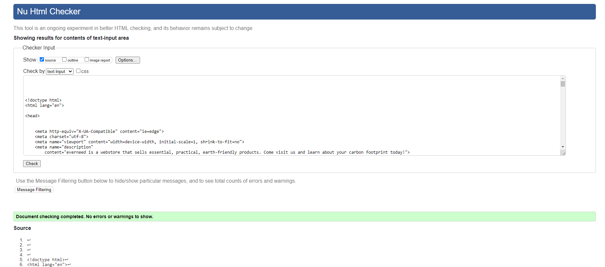  

All HTML pages were validated and received a 'No errors or warning to show' for code that I had written, result as shown above.

| HTML Source Code/Page | Errors | Warnings |
| ---- | ------ | -------- |
| Home | 0 | 0 |
| Log In | 0 | 0 |
| Register | 0 | 0 |
| Account | 0 | 0 |
| Wishlist | 0 | 0 |
| Admin Dashboard | 0 | 0 |
| Admin Article List | 0 | 0 |
| Admin Add Article | 0 | 0 |
| Admin Edit Article | 0 | 0 |
| Admin Delete Article | 0 | 0 |
| Admin Product List | 0 | 0 |
| Admin Product Detail | 0 | 0 |
| Admin Add Product | ID error |  |
| Admin Edit Product | ID error |  |
| Admin Delete Product | 0 | 0 |
| All Products | 0 | 0 |
| User Article List | 0 | 0 |
| Bag - Empty | 0 | 0 |
| Bag - Products | 0 | 0 |
| Checkout | Errors/Warnings present as a result of Bootstraps form elements, not from the code that I have created. The email ID from the contact form html within the base.html is clashing with the email ID from the checkout html. These ID elements are embedded within the Bootstrap forms and are unaccessible to me without breaking my code up and reconfiguring the code. 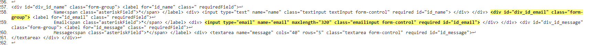 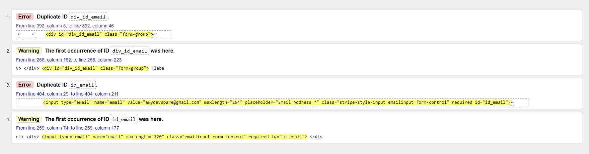 | As before |
| Wear| 0 | 0 |
| Care | 0 | 0 |
| Eat | 0 | 0 |
| Travel | 0 | 0 |
| Read | 0 | 0 |
| Profile/Account | 0 | 0 |
| Order History | 0 | 0 |
| Wishlist | 0 | 0 |
| Forgot Password | 0 | 0 |
| Error 403 | 0 | 0 |
| Error 404 | 0 | 0 |
| Error 500 | 0  | 0 |
| Footer - Contact Us & Thank You page | 0 | 0 |
| Footer    | Privacy Policy | External link - N/A | External link - N/A |
| Footer - Terms & Conditions   | Outside of my control there are multiple errors present as this page contains HTML Content from [Termly.com](https://termly.io/products/terms-and-conditions-generator/) to display the Terms & Conditions for Everneed. None of my templated code contains errors and I felt that attempting to correct all of the Termly errors would render the document incorrectly. I used Termly as they provided this content without personal cost to me. | As before. |

### JavaScript Validation

[JSHint](https://jshint.com/) was used to validate the JavaScript code added to the project. External JS, for Bootstrap, jQuery and Fontawesome purposes were not validated through JSHint.

| Page | Screenshot | Errors | Warnings |
| ---- | ---------- | ------ | -------- |
| Home | 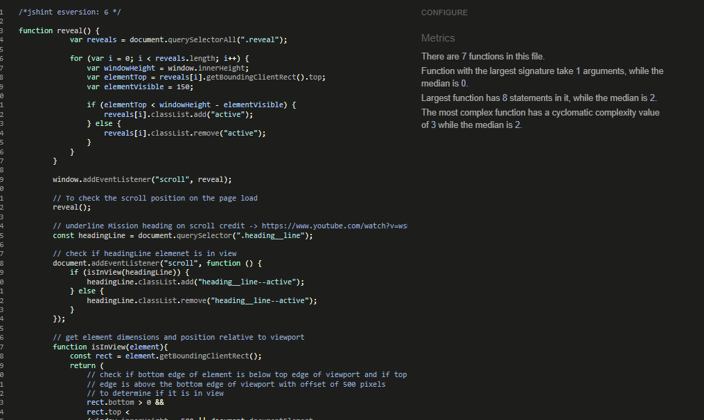 | none | none |
| Article | 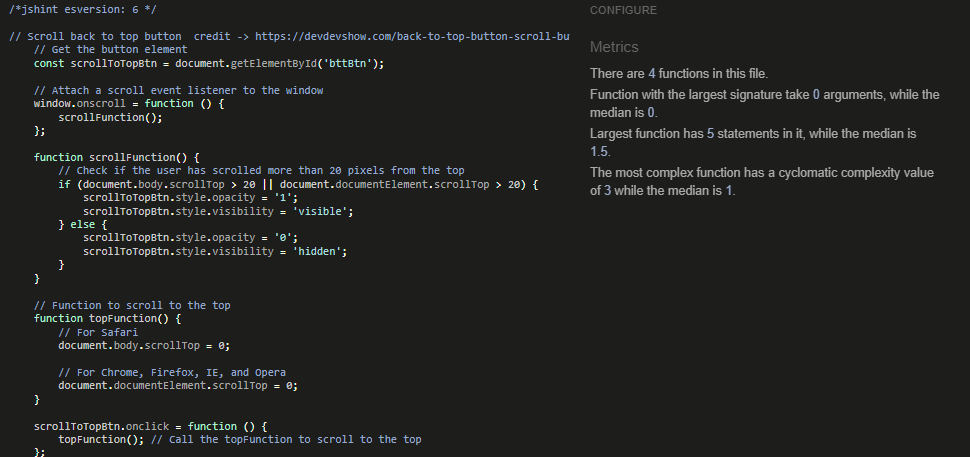 | none | none |
| Bag - Quantity Script | 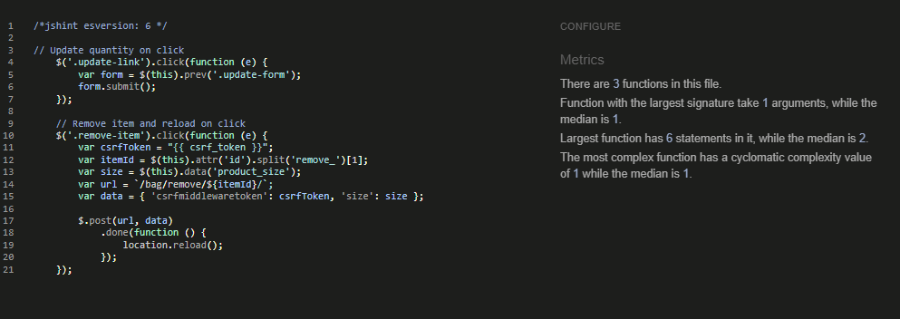 | none | none |
| Stripe JS | 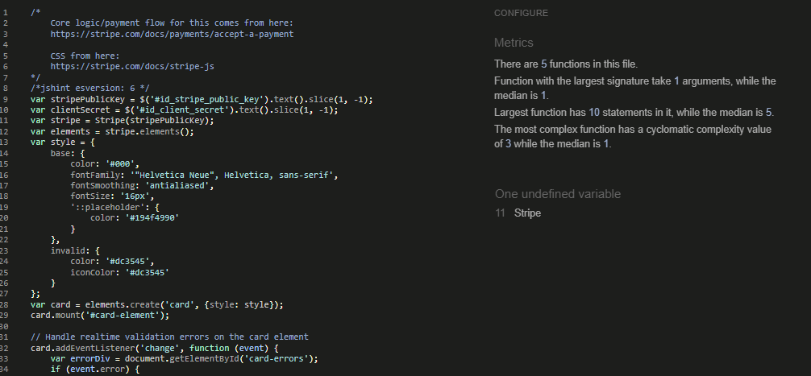 | none | none |
| Products Quantity Input Script | 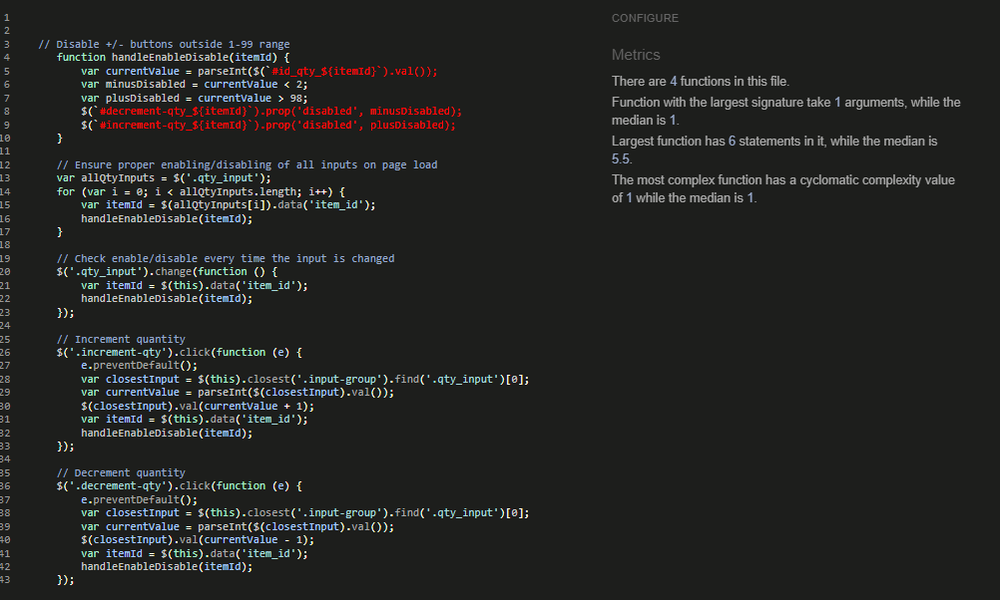 | none | none |
| Products Script | 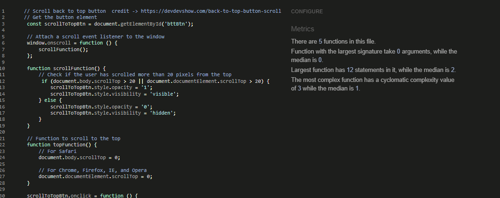 | none | none |
| Base Script | 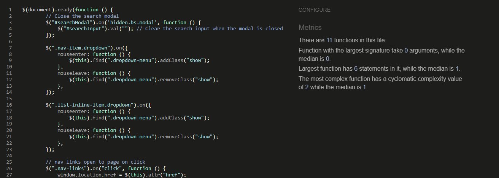 | none | none |

### Python Validation

[CI Python Linter](https://pep8ci.herokuapp.com/#) was used to validate the Python files that were created or edited by myself. No issues presented and line lengths were double checked. I have included some screenshots with the results below.

| Feature | admin.py | forms.py | models.py | urls.py | views.py |
|---------|----------|----------|-----------|---------|----------|
|

### CSS Validation

[W3C CSS Validator](https://jigsaw.w3.org/css-validator/) was used to validate my CSS files. External CSS for Bootstrap, provided by [CDN](https://cdn.jsdelivr.net/npm/bootstrap@4.6.2/dist/css/bootstrap.min.css) was not tested.

To keep my document concise I have not included every screenshot of the CSS validations, as they are all the same, but the results are as follows.
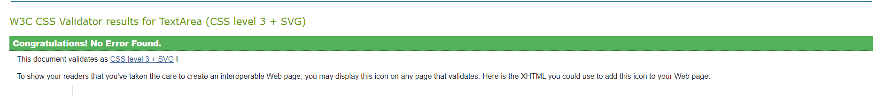

| CSS File | Errors | Warnings |
| ---- | ------ | -------- |
| Article | 0 | 0 |
| Checkout | 0 | 0 |
| Admin Products | 0 | 0 |
| Profiles/Accounts | 0 | 0 |
| Base CSS | 0 | 0 |

### Lighthouse Scores

Lighthouse testing was carried out in Incognito mode to acheive the best result. Images used in the sites design were saved in webp and png format, and compressed using [tinypng](https://tinypng.com/) and [Convertio](https://www.convertio.co) to offer the best chance for a decent performance score.

| Page | Lighthouse Scores | Notes |
| ---- | ----------------- | -------- |
| Home |                   |          |
| All  |                   |          |
| Categories |             |          |
| Read  |                  |          |
| Account |                |          |
| Admin Dashboard |        |          |
| Add Product     |        |          |
| Edit/Delete Product |           |        |
| Add Article |            |          |
| Edit/Delete Article |           |    |
| Wishlist |               |          |
| Bag  |                   |          |

### Wave Accessibility Score

Accessibility was included in every planning stage for Everneed, through the use of the WAVE report tool I could ensure that any necessary changes were made to make the website as accessible as it could be. 

| Page | Wave Scores | Notes |
| ---- | ----------------- | -------- |
| Home |                   |          |
| All  |                   |          |
| Categories |             |          |
| Read  |                  |          |
| Account |                |          |
| Admin Dashboard |        |          |
| Add Product     |        |          |
| Edit/Delete Product |           |        |
| Add Article |            |          |
| Edit/Delete Article |           |    |
| Wishlist |               |          |
| Bag  |                   |          |

## Manual Testing

### User Input/Form Validation

Testing was carried out on desktop using a Chrome browser to ensure all forms take the intended input and process the input appropriately.

| Feature                    | Tested?  | User Input Required | User Feedback Provided     | Pass/Fail | Fix |
|----------------------------|----------|---------------------|----------------------------|-----------|-----|
| Navbar Logo and Icons      | Yes      | Click Links bring user to correct destination    | Text Colour Change/Icon Animation/Dropdowns | Pass | N/A |
| Home Page                  | Yes      | Hover/Click interactive features | Carousel moves, Accordian FAQ section | Pass | N/A |
| Register Page              | Yes      | Text Input/Click Links | Form field highlight/Font weight change on hover/Toast message | Pass | N/A |
| Email Validate             | Yes      | Click Links | Button animation/Toast message | Pass | N/A |
| Forgot Password             | Yes     | Text Input/Click Links | Form field highlight/Button animation/Toast message | Pass | N/A |
| Log In Page                | Yes      | Text Input/Click Links | Form field highlight/Font weight on hover/Toast message | Pass | N/A |
| Log Out Page               | Yes      | Click Links bring user to correct destination | Button animation/Font color change/Toast message | Pass | N/A |
| Account - Edit Address     | Yes      | Text Input/Click to Save | Form field highlight/Button animation/Toast message | 
| Search                     | Yes      | Text Input/Click to Search | Pop up Modal/Form field highlight/Button Animation | Pass | N/A |
| Contact Us Form            | Yes      | Text Input/Click to Save | Pop up Modal/Form field highlight/Button animation | Pass | N/A |
| Newsletter Sign Up         | Yes      | Text Input/ Click to Subscribe | Button animation/New tab subscription confirmation | Pass | N/A |
| Admin Dashboard            | Yes      | Click Links brings user to correct URL | Button animation on hover | Pass | N/A |
| Products                   | Yes      | Click product brings user to product description | Pointer change on hover of products | Pass | N/A |
| Add Product                | Yes      |
| Edit Product               |
| View Article               | Yes      | Click link for article | Article card border change on hover | Pass | N/A |
| Add Article                |
| Edit Article               |
| Product Quantity           | Yes      | Click increment/decrement | Colour change on hover/product quantity successfully changed | Pass | N/A |
| Product Sizes              | Yes      | Click dropdown/Click to select | Form field highlight/Size highlight | Pass | N/A |
| Checkout                   |
| Footer                     | Yes      | Click Link brings user to FAQ section on Home Page | Font colour change on hover | Pass | N/A |
| Delivery Banner            | Yes      | Click dropdown to reveal banner | Dropdown arrow resize on hover/a=banner dropdown | Pass | N/A |

### Browser Compatibility

Freefido was tested on the following browsers, new users were created, old users data edited and all features were tested:

- Chrome v117.0.5938.92
- Firefox v114.0.2
- Edge v114.0.1823.79
- Safari v16.5.1

| Browser | Issue | Functionality |
|---------|-------|---------------|

### Responsiveness

### Testing User Stories

User Stories are documented in the Everneed [GitHub Projects Board](https://github.com/users/amylour/projects/6). User Stories are completed, with Acceptance Criteria and Tasks detailed within. Testing was carried out on Dev Tools for desktop/tablet/mobile, by creating multiple accounts for test users: Test01, Test02, Test03 etc and following through by ensuring that the Acceptance Criteria were met. All features were tested to ensure that they provided the user with the expected output and action.

| User Story                 | Acceptance Criteria Met?  | Tested | Response     | Pass/Fail | Fix     |
|----------------------------|---------------------------|--------|--------------|-----------|---------|
|

### Dev Tools/Real World Device Testing

Responsiveness testing was carried out using Google Dev Tools on the devices detailed within the below table. Responsiveness was evident on all features throughout all tested devices.

**Dev Tools Device Testing - all features tested, issues noted below**
| Device  | Feature    | Issue  | Fix  |
| ------- | ---------- | ------ |------|
| iPhone 4 | Order History table | Content overflow on y-axis | Separate media query created for screens max-width: 350px to cope with iPhone4 320px screen width, font-size reduced for order history table |
| iPhone12 Pro | All features | None | None  |
| Samsung Galaxy S20 | All features | None | None  |
| iPad Pro | All features | All features | None | None |

**Real World Device Testing**
| Device      | Feature    | Issue  | Fix  |
| ------------| ---------- | ------ |------|
| OPPO Reno 8 Lite |   All features    | No issues | None needed |
| iPhone XR | All features |  No issues  | None needed |
| iPhone 12  | All features | No issues | None needed |
| iPad Pro 2021 |    All features      |    No issues    |  None needed |
| Acer Aspire 3 2019 laptop | All features | No issues | None needed |

## Bugs

| No. | Bug | Solved | Fix | Solution Credit | Commit no. |
| --- | ---------------- | ---- | ------------- | -------------- | ------------|
| 1   | JavaScript dropdown menu fix | Yes | moving the mouseleave function outside of the main code seems to fix the 'dropdown menu randomly not appearing on hover' issue, This did not fix it, 2nd fix was to update to Bootstrap 4.6 and add 'ease' to menu hover transitions. Currently working consistently, 'pb-2' added to'all' fully fixed it | Investigating the CSS myself | e27b7a5/2aab065 |
| 2   | UnboundLocalError:Local variable 'categories' referenced before assignment & navbar active item styling. 'All' products option not displaying due to category = None when it was necessary for it to be categories. | Yes | Changed to categories = [] to initialize as empty list and added 'not request.GET.category' to 'all' nav-item li tag to remove bold styling when other product categories selected. | Stackoverflow <https://tinyurl.com/26a5ksrd> & CareerKarma <https://tinyurl.com/yc847kb7> | 76e8ef8 |
| 3   | Checkout form info not saving to Profile/Account form on checkout success. The 'save_info' section of checkout_success did not save the changed user info to the user's profile. | Yes | I considered that I may have caused an issue with my Wishlist app signals/contexts but after debugging their was no issue. Debugging with print statements to the terminal showed that the checkout form data was not being saved. I tried several fixes. First was to clear the site data via Dev Tools->Application->Clear Site Data and restart the server. No positive fix. I then backtracked to some earlier commits and removed the 'full_name' field that I had added to my UserProfile models and changed the '_' in checkout.html name='save_info' to name='save-info'. Tested my code with superuser and created a new user to find the issue resolved and no issue with Wishlist app. | Fix credit -> Gemma from Tutor Support for helping me to confirm my debugging process was correct and the 'Clear SiteData' tip, and a strong coffee for the second pass at spotting and fixing the bug. | 7659ada |
| 4  | Email Confirmation for order displaying multiple zeros at the end of the totals. | Yes | Fixed with '|floatformat:2' in confirmation_email.txt | Fixed by developer | 5774e14 |
| 5  | Bag 'Remove' removes all items with same id but different sizes, if I wanted to remove a medium black tshirt and leave the small black tshirt, code was removing both black tshirts. | Yes | Fixed in quantity_update_script, removed `'size':size` and replaced with `'product_size`:size as per the product models. | Fixed by developer |  |
| 6 | Sizes not showing in Checkout Success/Order History | Yes | Fixed by changing products.size to products_size | Fixed by developer, typo |  |

### Unresolved/Known Bugs

There are